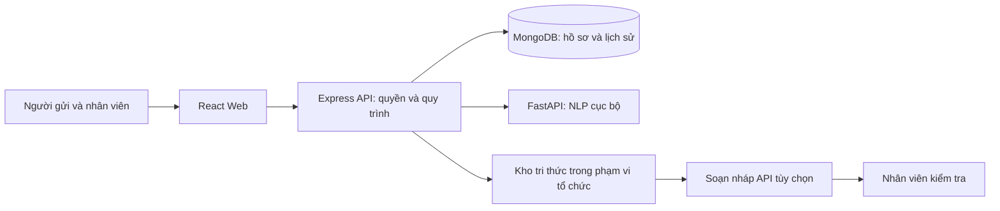
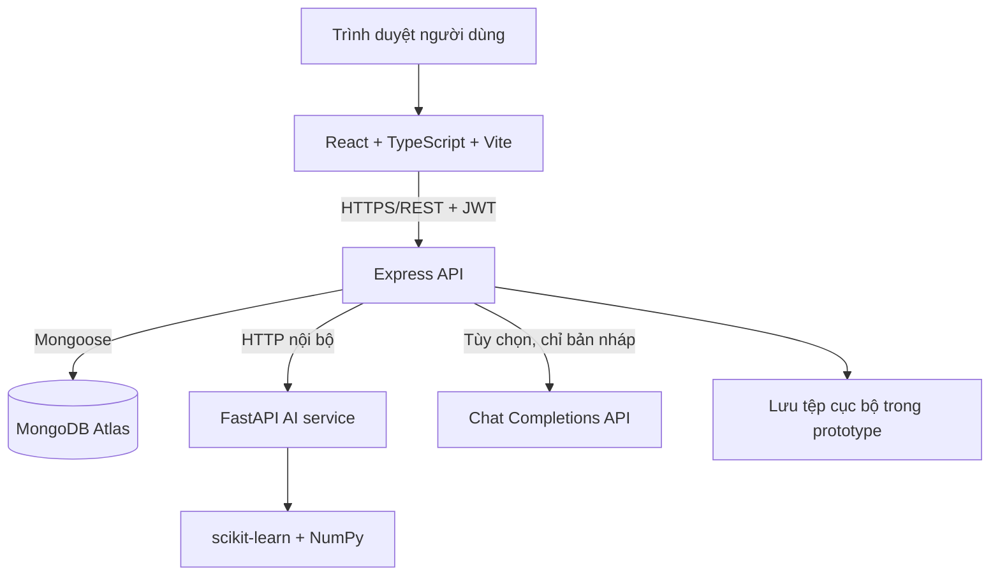
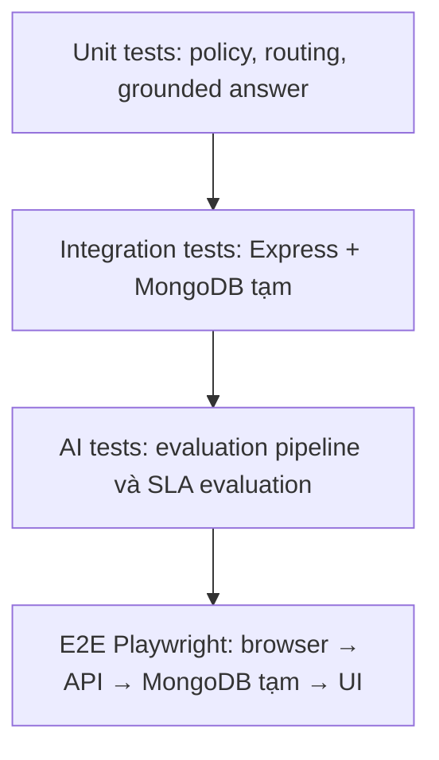
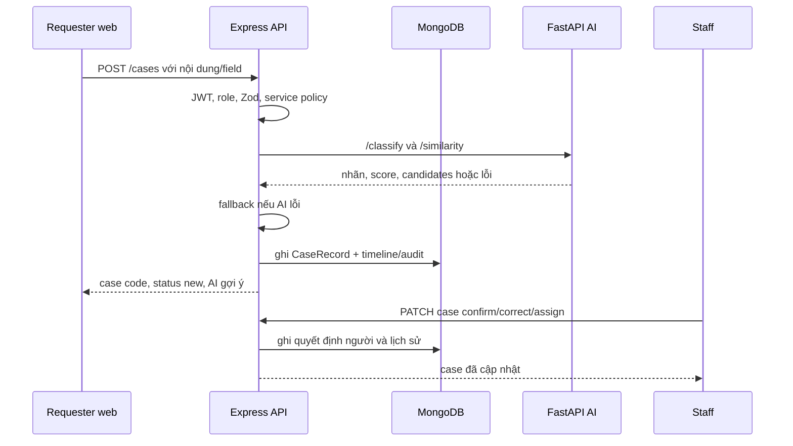
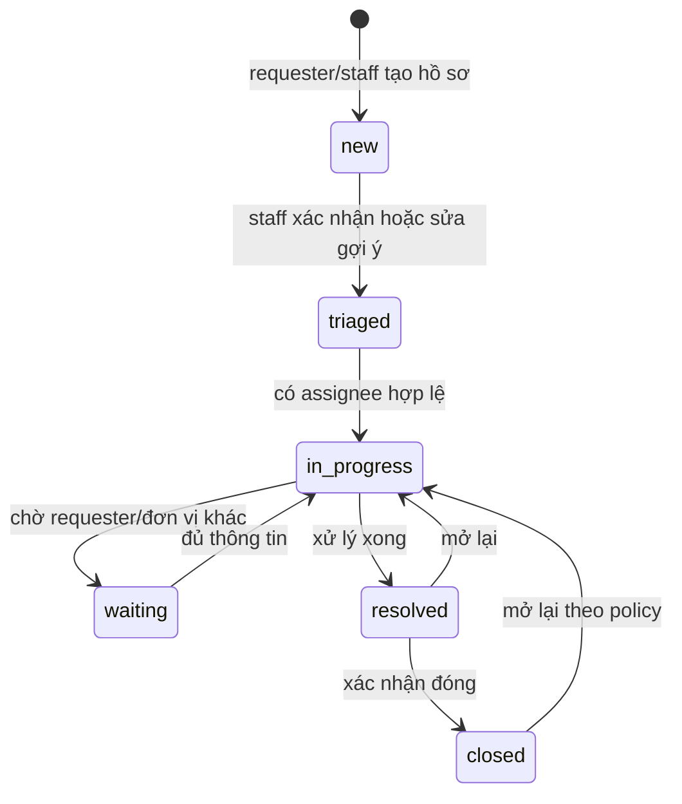

# CaseFlow AI: pitching và chuẩn bị trao đổi với giảng viên hướng dẫn

Tài liệu chuẩn bị cho buổi trao đổi với TS. Nguyễn Thị Mai Trang. Đối chiếu mã nguồn, dữ liệu demo và kiểm thử trong workspace đến ngày 12/09/2026. Đây là đề xuất phạm vi nghiên cứu và tài liệu luyện trình bày, không phải báo cáo nghiệm thu hay lời khẳng định hệ thống đã sẵn sàng triển khai diện rộng.

## 1. Chốt thông điệp trước khi học chi tiết

Tên đề xuất: **Hệ thống hỗ trợ tiếp nhận và điều phối yêu cầu dịch vụ trong trường đại học ứng dụng xử lý ngôn ngữ tự nhiên**.

Tên rộng hơn: **Hệ thống quản lý yêu cầu dịch vụ tích hợp AI hỗ trợ phân loại và truy xuất tri thức**.

Nên xin cô chốt tên sau khi thống nhất dữ liệu và đóng góp chính. Dùng trường đại học làm phạm vi đánh giá; khả năng cấu hình cho tổ chức khác là hướng mở rộng kiến trúc, chưa phải kết quả tổng quát hóa đã chứng minh.

Câu mô tả một dòng: CaseFlow quản lý vòng đời yêu cầu hỗ trợ; AI đọc nội dung tiếng Việt để gợi ý nhóm dịch vụ, giúp nhân viên điều phối và tra cứu tài liệu trước khi phản hồi.

Ba điều cần chứng minh: vấn đề có thật; giải pháp vận hành được; tác dụng của AI được đo bằng đối chứng.

## 2. Bài nói 90 giây

“Thưa cô, nhóm em muốn giải quyết bài toán tiếp nhận và điều phối yêu cầu hỗ trợ trong trường đại học, trước mắt tập trung vào dịch vụ sinh viên và hỗ trợ CNTT.

Giả thuyết thực tế của nhóm là khi yêu cầu được tiếp nhận qua nhiều người và nhiều kênh, nhân viên phải đọc, xác định đơn vị phụ trách, hỏi lại thông tin và theo dõi thủ công. Nhóm cần khảo sát để xác nhận mức độ của vấn đề này ở một đơn vị cụ thể.

Giải pháp là một hệ thống quản lý hồ sơ xuyên suốt từ tiếp nhận đến hoàn thành. AI hỗ trợ phân loại nội dung tiếng Việt, đưa ra các nhãn ứng viên; nhân viên xác nhận trước khi xử lý. Kho tri thức hỗ trợ tìm quy định liên quan và tạo bản nháp có nguồn để nhân viên kiểm tra.

Phần nghiên cứu chính em đề xuất là đánh giá phân loại yêu cầu trong điều kiện dữ liệu hạn chế, so sánh luật, TF-IDF và PhoBERT nếu dữ liệu cho phép; đồng thời khảo sát cơ chế chuyển cho người xử lý khi mô hình không chắc chắn. Nhóm sẽ đo macro-F1, lỗi chuyển đơn vị và thời gian phân loại, không chỉ đo chất lượng câu trả lời của chatbot.

Hiện nhóm đã có prototype và baseline. Dữ liệu nghiệp vụ còn ít, nên em muốn xin cô góp ý về phạm vi nhãn, cách thu thập dữ liệu và thiết kế thực nghiệm phù hợp cho hai người.”

## 3. Khung pitching 8-10 phút

| Thời lượng | Nội dung | Bằng chứng hoặc điều cần xin ý kiến |
|---|---|---|
| 1 phút | Ai gặp vấn đề, quy trình hiện tại | Tình huống cụ thể; nói rõ chưa khảo sát nếu chưa có |
| 1 phút | Hậu quả cần đo | Thời gian phân loại, chuyển nhầm, phản hồi chậm |
| 1,5 phút | Quy trình đề xuất | Một yêu cầu từ tạo đến đóng; ai chịu trách nhiệm |
| 1 phút | AI và luật nghiệp vụ | Nhãn AI, mapping đơn vị, xác nhận của nhân viên |
| 2 phút | Nghiên cứu và dữ liệu | Baseline, PhoBERT, tập test, ngưỡng chuyển người |
| 1 phút | Kiến trúc và demo | Web, API, MongoDB, AI service; cơ chế khi AI lỗi |
| 1 phút | Giới hạn và kế hoạch | Dữ liệu ít; SLA mô phỏng; phạm vi hai người |
| 0,5 phút | Xin cô chốt | Bối cảnh pilot, đóng góp chính, nguồn dữ liệu |

Không mở đầu bằng danh sách framework. Nêu công nghệ sau khi cô đã hiểu bài toán và lý do cần từng thành phần.

## 4. Bài toán nghiệp vụ, hiểu đến tận cùng

### Người trả tiền công sức là ai?

Người gửi cần biết ai đang xử lý và khi nào nhận được phản hồi. Nhân viên cần đủ thông tin, đúng hàng đợi và tài liệu tin cậy. Điều phối viên cần nhìn được tồn đọng, chuyển nhầm và tải công việc. Người quản trị cần quản lý quyền, danh mục và chính sách dịch vụ.

Các lợi ích này là giả thuyết cần khảo sát. Chưa có cơ sở nói hệ thống tiết kiệm một tỷ lệ phần trăm cụ thể.

### Tại sao không gọi điện cho nhanh?

Gọi điện có thể là kênh nhanh nhất cho tình huống khẩn. CaseFlow vẫn cho phép nhân viên ghi nhận yêu cầu nhận qua điện thoại vào hồ sơ; người dùng không cần tự nhập lại. Giá trị nằm ở theo dõi và phối hợp sau khi tiếp nhận: trách nhiệm thuộc ai, đang thiếu gì, có quá hạn không, các lần xử lý trước ra sao.

Với nhóm nhỏ ít yêu cầu, một cuộc gọi hoặc bảng tính có thể đủ tốt. Đồ án cần xác định trường hợp có nhiều đơn vị, công việc kéo dài hoặc cần truy vết để lợi ích đáng với chi phí nhập liệu. Không ép mọi vấn đề phải đính kèm ảnh, điền form dài hay đi qua chatbot.

### Khác cổng sinh viên hoặc quản lý nhân sự thế nào?

Cổng sinh viên thường xoay quanh dữ liệu học tập và thủ tục; quản lý nhân sự xoay quanh nhân viên. Đối tượng trung tâm của CaseFlow là yêu cầu cần được giải quyết và lịch sử trách nhiệm. Tuy nhiên, chức năng quản lý ticket và hỗ trợ AI không phải ý tưởng hoàn toàn mới. Không nên tuyên bố vượt các sản phẩm thương mại khi chưa có so sánh trực tiếp.

Đóng góp phù hợp với đồ án là cấu hình bài toán tại một đơn vị, dữ liệu tiếng Việt, thực nghiệm các mô hình và đánh giá ảnh hưởng của hỗ trợ AI lên công việc. Nếu cô yêu cầu đóng góp thuật toán mới, cần thống nhất lại trọng tâm; tích hợp nhiều module tự nó chưa đáp ứng yêu cầu đó.

### Một ví dụ đi xuyên hệ thống

Sinh viên viết: “Em không đăng nhập được cổng học tập, tối nay hết hạn nộp bài.”

1. Hệ thống lưu yêu cầu và cấp mã hồ sơ trước; AI lỗi cũng không làm mất yêu cầu.
2. AI phân loại nội dung, đưa ra nhóm hỗ trợ tài khoản và các nhãn ứng viên. Ví dụ này minh họa đầu ra mong muốn, không phải kết quả vừa đo trên model.
3. Hệ thống đối chiếu danh mục để gợi ý đơn vị phụ trách. Nhãn nghiệp vụ và đơn vị tổ chức là hai khái niệm khác nhau.
4. Nhân viên xem nội dung, xác nhận hoặc sửa nhãn, kiểm tra hạn nộp bài và mức ảnh hưởng để quyết định ưu tiên.
5. Hồ sơ được giao xử lý, cập nhật trạng thái; trao đổi công khai và ghi chú nội bộ có quyền xem khác nhau.
6. Nhân viên truy xuất hướng dẫn đã được phê duyệt. Nếu bật LLM, nhận bản nháp có nguồn và kiểm tra trước khi gửi.
7. Hoàn thành, ghi lịch sử, tính thời gian phản hồi/giải quyết. Việc sửa nhãn có thể trở thành dữ liệu ứng viên cho đợt huấn luyện sau, sau khi kiểm duyệt.

Một hồ sơ chứa hai việc độc lập, như “không đăng nhập được và cần xác nhận học phí”, cần chính sách rõ: chọn một nhãn chính và chuyển nhân viên, hoặc tách hồ sơ có liên kết. Multi-label là hướng sau, không tự thêm vào cam kết ban đầu.

## 5. Phạm vi và đóng góp đề xuất

Đóng góp chính: thực nghiệm phân loại yêu cầu tiếng Việt và chính sách gợi ý có cơ chế chuyển người trong bối cảnh dữ liệu hạn chế.

Đóng góp hệ thống: đưa dự đoán vào quy trình có xác nhận, phân quyền, lịch sử và đo lường. Đánh giá con người sử dụng gợi ý, thay vì coi điểm mô hình offline là kết quả cuối.

Đóng góp bổ trợ: truy xuất tri thức và soạn nháp có nguồn, đánh giá riêng khả năng tìm đúng tài liệu và độ được nguồn hỗ trợ của nội dung sinh.

| Mức | Phạm vi |
|---|---|
| Cốt lõi | Hồ sơ, vai trò, trạng thái, phân công, timeline, danh mục, SLA theo quy tắc |
| Nghiên cứu chính | Taxonomy, corpus, luật/TF-IDF/PhoBERT nếu khả thi, lỗi và uncertainty |
| Bổ trợ có giới hạn | Kho tri thức, retrieval, bản nháp LLM có người duyệt |
| Có dữ liệu mới nâng cấp | Dự báo SLA thực tế, tối ưu phân công, phát hiện sự cố tự động |
| Ngoài cam kết đầu | Mọi ngành, tích hợp mọi kênh, tự xử lý hoàn toàn, training LLM từ đầu |

Không nên nhận đồng thời phân loại đa nhãn, NER học sâu, SLA prediction, incident clustering, agent tự động và RAG nâng cao làm các mục tiêu nghiên cứu ngang nhau.

## 6. Đã có gì, được phép khẳng định gì?

| Thành phần | Bằng chứng đang có | Cách nói đúng |
|---|---|---|
| Web/API/MongoDB | Cấu trúc ứng dụng và tài liệu kiến trúc | Có prototype; chưa suy ra chịu tải production |
| Phân loại | `apps/ai/models/classifier.py`: word unigram/bigram, Logistic Regression, huấn luyện khi import | Baseline cục bộ, khoảng 60 câu minh họa/6 nhóm theo tài liệu |
| Ngưỡng gợi ý | `apps/api/src/services/routing.ts`: 0,55 | Hằng số kỹ thuật hiện tại, chưa phải ngưỡng tối ưu đã thực nghiệm |
| Trích xuất | Pattern/regex theo tài liệu và module text_utils | Trích xuất theo quy tắc; không gọi là model NER đã fine-tune |
| MASSIVE tiếng Việt | Báo cáo `OPEN_DATA_BASELINE_RESULTS.md` | Benchmark ngoài miền, không phải chất lượng CaseFlow |
| Soạn nháp | `groundedAnswer.ts` gọi API với nguồn và kiểm tra định dạng/citation | Đã có tích hợp tùy chọn; citation hợp lệ chưa đảm bảo câu đúng |
| PhoBERT | Tài liệu kế hoạch | Đề xuất so sánh, chưa xác nhận đã fine-tune |
| SLA ML | `sla_predictor.py`: 2.500 mẫu sinh từ công thức định trước | Mô phỏng pipeline; chưa chứng minh dự báo vận hành |
| Hiệu quả người dùng | Quy trình thử nghiệm đã viết | Chưa có kết quả pilot để báo cáo giảm thời gian |

Báo cáo MASSIVE ghi character TF-IDF + Logistic Regression đạt accuracy khoảng 82,99%, macro-F1 khoảng 0,781 trên tập test sau khử trùng lặp chính xác. Mô hình được chọn bằng validation macro-F1. Đây là kết quả lưu trong repository, chưa chạy tái lập ở lần chuẩn bị tài liệu này. Benchmark này không tự thay model đang phục vụ CaseFlow.

Tài liệu `AI_AND_DATA.md` còn ghi chưa sinh câu trả lời tự do; `HYBRID_AI_SETUP.md` và mã `groundedAnswer.ts` cho thấy đã có đường soạn nháp tùy chọn. Khi trình bày, dùng trạng thái mới này. Tài liệu tích hợp ghi lần kiểm tra 11/09 bị thiếu quota; chưa kiểm tra lại trạng thái API hiện tại.

## 7. Thiết kế nghiên cứu có thể bảo vệ

### RQ1: Mô hình nào phù hợp với yêu cầu tiếng Việt ít dữ liệu?

Giả thuyết: character TF-IDF có thể chịu lỗi gõ tốt hơn word TF-IDF; PhoBERT có thể tốt hơn ở câu diễn đạt đa dạng, nhưng phải đo. Không mặc định mô hình lớn hơn tốt hơn.

So sánh: majority class; luật từ khóa; word TF-IDF + Logistic Regression; character TF-IDF + Logistic Regression; word TF-IDF + LinearSVC; PhoBERT với classification head nếu đủ nguồn lực. Chọn tập ứng viên cuối cùng cùng cô để tránh thí nghiệm dàn trải.

Giữ nguyên tập dữ liệu, split, hướng dẫn nhãn và chính sách chọn cấu hình. Chỉ fit vocabulary, IDF, scaler và model trên training. Chọn hyperparameter/ngưỡng trên validation. Đánh giá test sau khi khóa phương án.

TF-IDF biểu diễn văn bản bằng mức quan trọng của các token; LR học ranh giới phân loại. Công thức khái niệm: trọng số từ bằng tần suất trong câu nhân với độ hiếm trong corpus; xác suất lớp từ softmax của tổ hợp tuyến tính các trọng số. Cấu hình thư viện có smoothing/normalization cụ thể, cần lưu để tái lập.

Một chi tiết dễ bị hỏi: word TF-IDF mặc định không đồng nghĩa đã tách từ tiếng Việt chuẩn; “học phí” gồm hai token có thể được bắt bằng bigram. Tách từ là một biến thực nghiệm riêng. PhoBERT cần tiền xử lý tách từ theo hướng dẫn chính thức; phải giữ nhất quán khi huấn luyện và suy luận. [PhoBERT, VinAI](https://github.com/VinAIResearch/PhoBERT).

### RQ2: Khi nào nên tin gợi ý và khi nào chuyển người?

Mô hình phân loại đóng luôn chọn trong các nhãn đã biết, kể cả câu ngoài miền. Max probability cao không chứng minh câu thuộc miền hay dự đoán đúng. Bản hiện tại chưa có đánh giá open-set hoàn chỉnh.

Thực nghiệm đề xuất: khảo sát ngưỡng trên validation, báo cáo coverage và selective error. Coverage = tỷ lệ câu đủ điều kiện nhận gợi ý tự tin; selective error = tỷ lệ sai trong chính tập câu đó. Ngưỡng cao có thể giảm sai nhưng tăng việc cần con người. Chọn điểm cân bằng dựa trên chi phí chuyển nhầm, không chọn 0,8 chỉ vì nhìn có vẻ an toàn.

Cần có tập câu ngoài phạm vi, câu trống nghĩa, câu thiếu thông tin và câu nhiều ý để thử cơ chế chuyển người. Calibration dùng validation hoặc cross-validation trong tập phát triển, không dùng test. Điểm predict_proba hiện chưa được chứng minh hiệu chuẩn. [Tài liệu calibration của scikit-learn](https://scikit-learn.org/stable/modules/calibration.html).

Trong prototype, nhân viên vẫn xác nhận bước phân loại. Nghiên cứu threshold chưa có nghĩa hệ thống đã được phép tự giao việc ở production.

### RQ3: Hỗ trợ AI có cải thiện công việc thực tế?

So sánh trên cùng hệ thống hai chế độ: AI tắt và AI bật. Như vậy mới tách được tác dụng AI khỏi tác dụng của giao diện và việc tập trung hóa hồ sơ.

Đo thời gian đến quyết định phân loại đúng, tỷ lệ chuyển đúng đơn vị, số lần sửa/đọc lại, tỷ lệ hoàn thành và mức tải cảm nhận. Không dùng tỷ lệ chấp nhận gợi ý làm đại diện duy nhất cho độ đúng: nhân viên có thể tin máy quá mức.

Nếu cùng người thử cả hai chế độ, dùng các bộ tình huống tương đương và đảo thứ tự giữa người tham gia để giảm hiệu ứng học. Lưu số người, kinh nghiệm, số tác vụ, cách chọn mẫu và hạn chế; tác vụ cùng một người không phải các quan sát hoàn toàn độc lập. Nhóm ít người chỉ cho bằng chứng thăm dò, không đại diện mọi đơn vị.

## 8. Dữ liệu: phần quan trọng nhất của buổi trao đổi

### Phải tách ba loại dữ liệu

1. Corpus yêu cầu có nhãn để học phân loại: văn bản, nhãn chuẩn, nguồn, thời điểm, nhóm trùng lặp và trạng thái kiểm duyệt.
2. Kho tri thức để truy xuất: văn bản quy định/FAQ đã duyệt, đơn vị sở hữu, quyền xem, phiên bản và hiệu lực. Không bắt buộc fine-tune LLM mỗi khi cập nhật tài liệu.
3. Log vận hành để đánh giá quy trình hoặc học SLA: thời gian, chuyển đơn vị, tải tại thời điểm dự báo, kết quả và lịch sử can thiệp.

Gọi API là sử dụng model bên ngoài để suy luận. Fine-tune là cập nhật trọng số bằng dữ liệu huấn luyện. RAG là đưa các đoạn truy xuất được vào ngữ cảnh. Ba việc này không đồng nghĩa.

### Chọn nhãn thế nào?

Bắt đầu khoảng 6 nhóm hiện có hoặc số nhóm cô chấp thuận; ưu tiên nhãn có ý nghĩa nghiệp vụ và có thể phân biệt từ thông tin tại thời điểm tiếp nhận. Mỗi nhãn cần định nghĩa, ví dụ đúng, ví dụ dễ nhầm, quy tắc loại trừ và người quyết định khi bất đồng.

Không học trực tiếp tên nhân viên làm nhãn phân loại. Dự đoán loại dịch vụ trước, sau đó map đến đơn vị theo cấu hình. Khi cơ cấu phòng ban thay đổi, có thể đổi mapping mà không nhất thiết học lại ngôn ngữ.

### Nguồn dữ liệu mở đóng vai trò gì?

MASSIVE có dữ liệu tiếng Việt gán nhãn ý định, hữu ích để thử pipeline và so sánh mô hình trên benchmark bên ngoài. Miền trợ lý ảo của bộ này khác ticket học vụ/IT. Không đổi tên nhãn của MASSIVE thành nhãn CaseFlow rồi coi như có dữ liệu đúng miền. [Giới thiệu của Amazon Science](https://www.amazon.science/blog/amazon-releases-51-language-dataset-for-language-understanding).

Nguồn đúng miền ưu tiên là yêu cầu đã ẩn danh từ đơn vị hợp tác, tình huống do chuyên viên mô tả, hoặc người tham gia viết yêu cầu dựa trên nhu cầu thật. Dữ liệu sinh có thể bổ trợ training, phải ghi nguồn và không dùng làm tập test chính duy nhất.

Mỗi nguồn cần ghi phiên bản, giấy phép, ngôn ngữ, miền, phương thức lấy, việc được phép tái sử dụng và biến đổi đã làm. “Trên mạng” không đồng nghĩa được phép thu thập hay hợp với bài toán.

### Cần bao nhiêu mẫu?

Không có con số đảm bảo model thông minh. Đề xuất một đợt ban đầu 300-600 yêu cầu tổng để kiểm tra taxonomy và độ khó, rồi mở rộng theo learning curve và lớp thiếu dữ liệu. Đây là kế hoạch, không phải chuẩn bắt buộc. Mục tiêu 300-500 mẫu mỗi lớp trong tài liệu cũ có thể vượt nguồn lực; cần cô chốt khả năng thu thập trước.

Nếu 6 lớp chỉ có 50 câu/lớp, chia test 20% có thể chỉ còn khoảng 10 câu mỗi lớp; sai thêm một câu làm recall lớp đó thay đổi khoảng 0,10. Khi dữ liệu nhỏ, cần nêu khoảng bất định và tránh kết luận mạnh từ chênh lệch nhỏ.

### Gán nhãn và chống rò rỉ

Hai người gán độc lập một phần corpus, ví dụ 20-30%; chuyên viên hoặc cô hỗ trợ phân xử trường hợp khó. Báo cáo tỷ lệ đồng thuận, Cohen's kappa nếu phù hợp, phân bố nhãn và các cặp nhãn hay bất đồng. Đồng thuận cao không tự chứng minh nhãn phù hợp thực tiễn.

Các câu cùng hồ sơ, cùng sự cố hoặc diễn đạt lại từ cùng mẫu phải ở cùng một split. Với dữ liệu tổng hợp, giữ chung nhóm theo mẫu gốc. Nếu lấy nhiều ngôn ngữ song song, kiểm soát cả ID nguồn xuyên ngôn ngữ. Khử exact duplicate không loại hết paraphrase.

Tách theo thời gian nếu muốn mô phỏng vận hành tương lai; dùng grouped split nếu phụ thuộc theo người/hồ sơ. Không vừa dùng test để sửa rule vừa tiếp tục gọi đó là test độc lập. Giữ một tập development để phân tích lỗi thường xuyên.

## 9. Các chỉ số và ý nghĩa

| Chỉ số | Cách hiểu và giới hạn |
|---|---|
| Accuracy | Tỷ lệ nhãn đúng chung; có thể che mất lớp hiếm |
| Precision một lớp | Trong các câu dự đoán vào lớp đó, bao nhiêu câu đúng |
| Recall một lớp | Trong các câu thực sự thuộc lớp đó, bắt được bao nhiêu |
| F1 | 2PR/(P+R), cân bằng precision và recall |
| Macro-F1 | Tính F1 từng lớp rồi trung bình, mỗi lớp có trọng số bằng nhau |
| Micro-F1 | Gộp TP/FP/FN; single-label multiclass tính đủ lớp thì bằng accuracy |
| Confusion matrix | Cho thấy cặp nhãn nhầm, cần ghi rõ hàng thật/cột dự đoán |
| Routing accuracy | Tỷ lệ chuyển đúng đơn vị theo chính sách nghiệp vụ |
| Coverage/selective error | Bao nhiêu câu được gợi ý ở mức tự tin đã chọn và sai bao nhiêu |
| Latency p50/p95 | Thời gian suy luận thường gặp và đuôi chậm; nêu máy và tải đo |

Micro-F1 và accuracy trùng nhau trong điều kiện trên không phải lỗi pipeline. Macro-F1 hữu ích vì không để lớp nhiều dữ liệu lấn át mọi lớp khác. [Định nghĩa metric của scikit-learn](https://scikit-learn.org/stable/modules/model_evaluation.html).

Phân loại đúng nhãn chưa chắc routing tốt nếu mapping sai hoặc đơn vị không đủ thẩm quyền. Ngược lại, hai nhãn khác nhau có thể cùng về một đơn vị. Cần đo cả hai mức.

Để so sánh mô hình, báo cáo điểm trên cùng test, vài seed khi phù hợp và khoảng tin cậy nếu đủ dữ liệu. Bootstrap theo nhóm hồ sơ/sự cố khi dữ liệu phụ thuộc. Không tuyên bố thắng chắc chỉ vì hơn 0,5 điểm trên test nhỏ.

## 10. RAG: hiểu rõ đường đi và cách thất bại

Luồng đề xuất: tài liệu được duyệt -> lọc tổ chức/quyền/hiệu lực -> tìm các đoạn liên quan -> đưa query và đoạn nguồn vào LLM -> kiểm tra định dạng và nguồn -> nhân viên duyệt.

Baseline đang dùng retrieval TF-IDF; dense embedding, vector index và reranker là ứng viên nâng cấp cần đánh giá, không mặc nhiên đã có. Trước tiên chứng minh baseline tìm đúng nguồn; cải thiện bằng mô hình embedding hoặc hybrid search khi lỗi synonym/paraphrase thực sự đáng kể.

Hai tầng đánh giá cần tách:

- Retrieval: bộ câu hỏi có tài liệu liên quan chuẩn; Hit@k, Recall@k và MRR. Nếu một câu có nhiều nguồn đúng, Hit@k chỉ yêu cầu tìm được một nguồn còn Recall@k tính phần nguồn liên quan đã tìm được.
- Generation: nội dung có đúng, đủ, được trích đoạn hỗ trợ và dẫn đúng chỗ không; đo trên câu trả lời, không chỉ kiểm tra ID tồn tại.

Tình huống thử: có đáp án; không có đáp án; thiếu dữ kiện; tài liệu mâu thuẫn; văn bản hết hiệu lực; truy vấn ngoài quyền; tài liệu có câu lệnh cố thao túng model. Hai người đánh giá một phần đầu ra, có rubric và cách giải quyết bất đồng. LLM-as-judge nếu dùng chỉ là phụ trợ, phải so với đánh giá người.

Mã hiện tại giới hạn tối đa bốn trích đoạn, timeout 12 giây, kiểm tra JSON và citation; khi lỗi trở về retrieval. Đây là các biện pháp kiểm soát, không phải chứng minh loại bỏ hallucination. Filter email/số hiện không ẩn danh toàn bộ dữ liệu. Không đưa tài liệu nội bộ nhạy cảm ra API bên ngoài khi đơn vị chưa cho phép.

## 11. SLA và phân công: tránh biến luật thành tuyên bố AI

SLA là cam kết thời gian cho một dịch vụ. Cần phân biệt hạn phản hồi đầu tiên và hạn giải quyết; quy định giờ làm việc, ngày nghỉ, tạm dừng khi chờ bổ sung và điều kiện mở lại. Một bộ đếm đến hạn đúng nghiệp vụ đã có giá trị mà không cần mô hình học máy.

Model SLA hiện học dữ liệu từ công thức mô phỏng. Nếu train và test đều sinh từ cùng công thức, điểm cao chủ yếu chứng minh model học lại quan hệ đã cài, chưa chứng minh dự báo thực tế.

Nếu làm SLA prediction thật, tại thời điểm t chỉ dùng thông tin biết ở t. Không dùng số lần chuyển cuối cùng, thời gian hoàn thành, tổng bước cuối cùng hoặc workload tương lai. Nhiều snapshot cùng hồ sơ phải nằm cùng split. Các hồ sơ đã quá hạn cần tách khỏi bài toán cảnh báo trước hạn; nếu gộp vào, model có thể có điểm đẹp nhưng vô dụng.

So sánh với luật thời gian đã dùng >= 80%, đo PR-AUC, calibration và thời gian báo trước. Hồ sơ chưa hoàn thành là dữ liệu chưa biết kết cục, không tự gán thành không trễ. Phải định nghĩa cửa sổ quan sát hoặc xử lý kiểm duyệt phù hợp.

Phân công có thể dùng bộ phận, kỹ năng, quyền và số việc đang mở để xếp hạng theo luật. Chưa có bằng chứng benchmark thì không gọi là tối ưu phân công bằng AI. Đây là phần mở rộng sau khi có dữ liệu.

## 12. Kiến trúc: trả lời bằng lý do



Node/Express quản lý nghiệp vụ; FastAPI dùng thư viện Python cho ML. Tách service giúp thay model và triển khai tài nguyên riêng, đổi lại thêm lỗi mạng, cấu hình và giám sát. Với hai người, nên giữ nghiệp vụ dạng modular monolith; chưa cần tách mỗi tính năng thành một microservice.

MongoDB phù hợp hồ sơ có trường mở rộng theo danh mục dịch vụ. Không khẳng định nhanh hơn SQL trong mọi tình huống; PostgreSQL cũng có thể đáp ứng. Thiết kế cần validation, index theo tenant/trạng thái/thời gian, phân trang và kiểm soát cập nhật đồng thời. Timeline nhúng có thể tăng lớn; khi cần sẽ tách event collection. Tệp hiện ở ổ đĩa, MongoDB giữ metadata, chưa phải object storage.

Multi-tenant cần lọc organizationId ở server cho hồ sơ, tài liệu, truy xuất và cache; không tin ID tổ chức do client gửi. Đăng nhập theo vai trò chưa đủ: người dùng còn phải có quyền trên chính đối tượng. Sửa đồng thời nên có version check hoặc update có điều kiện; nhiều thay đổi cần nguyên tử phải được thiết kế rõ. Đây là yêu cầu cần kiểm tra, không tuyên bố mọi trường hợp đã hoàn thiện.

AI không khả dụng thì lưu hồ sơ, đưa vào hàng đợi xử lý tay và thông báo trạng thái thật. Không trả confidence giả hay gợi ý mặc định mà trình bày như dự đoán. Khi triển khai lớn cần queue, storage, backup/restore, quan sát lỗi và kiểm thử tải; mức đồng thời phải đo trên môi trường xác định trước khi công bố.

## 13. Ngân hàng câu hỏi cô có thể hỏi

**1. Em đang giải quyết vấn đề cho ai, ở đâu?**

“Nhóm dự kiến một đơn vị hỗ trợ sinh viên/IT trong trường. Hiện chưa có pilot được xác nhận; em muốn xin cô hỗ trợ chốt bối cảnh và tiếp cận người nghiệp vụ để khảo sát.” Không nói đang phục vụ cả trường khi chưa có đơn vị dùng.

**2. Tính mới ở đâu khi ticketing và chatbot đã có?**

“Em không khẳng định phát minh mô hình mới. Đóng góp dự kiến là corpus và đánh giá trên yêu cầu tiếng Việt đúng miền, so sánh mô hình dưới hạn chế dữ liệu, chính sách gợi ý có chuyển người và đo tác động lên điều phối. Em mong cô góp ý mức đóng góp này có phù hợp đồ án không.”

**3. Sao không dùng một phần mềm có sẵn?**

“Sản phẩm có sẵn có thể đáp ứng nhiều yêu cầu. Đồ án nhằm nghiên cứu và kiểm chứng một cấu hình cụ thể; để chứng minh khả năng ứng dụng em cần bảng fit-gap và thử với đơn vị mục tiêu. Em chưa kết luận giải pháp của em tốt hơn hay rẻ hơn sản phẩm thương mại.”

**4. Vì sao cần AI? Rule đủ chưa?**

“Rule là baseline bắt buộc vì nhãn có thể phân biệt tốt bằng từ khóa. Em thử ML ở các trường hợp diễn đạt đa dạng/lỗi gõ; nếu rule đạt chất lượng tốt hơn với chi phí thấp hơn, em giữ rule cho phần đó.”

**5. Cụ thể em training cái gì?**

“Hiện local classifier học ánh xạ văn bản sang nhãn dịch vụ bằng TF-IDF và LR. Dự kiến fine-tune classification head cùng PhoBERT nếu dữ liệu đủ. LLM API dùng để sinh nháp; RAG cung cấp tri thức trong ngữ cảnh. Em chưa huấn luyện lại LLM qua việc gọi API.”

**6. Tại sao PhoBERT?**

“Đây là ứng viên biểu diễn ngữ cảnh tiếng Việt. Em cần thử nó trên cùng dữ liệu với baseline, dùng tiền xử lý phù hợp, báo cáo chi phí và lỗi. Em chưa biết nó sẽ thắng trên corpus của em.”

**7. PhoBERT thua TF-IDF thì đề tài thất bại?**

“Không, nếu thực nghiệm đúng. Kết quả cho thấy baseline phù hợp hơn trong điều kiện khảo sát. Em phân tích dữ liệu, learning curve, độ nhiễu và chi phí; không chỉnh test để ép mô hình lớn thắng.”

**8. 60 câu hiện tại đủ chưa?**

“Chỉ đủ chạy prototype. Chưa đủ kết luận chất lượng đúng miền. Đợt đầu em muốn thu corpus nhỏ được kiểm duyệt để chốt nhãn, sau đó tăng theo learning curve và lỗi từng nhóm.”

**9. Có số liệu nào rồi?**

“Repository có báo cáo MASSIVE tiếng Việt khoảng 82,99% accuracy và 0,781 macro-F1 cho char TF-IDF + LR. Đây là ngoài miền CaseFlow; em cần tái lập artifact trước khi đưa vào báo cáo chính thức. Chưa có số liệu pilot chứng minh hiệu quả vận hành.”

**10. Em tự gán nhãn thì nhãn có đáng tin?**

“Nhóm sẽ viết guideline, gán độc lập một phần, ghi bất đồng và nhờ người nghiệp vụ phân xử. Nếu không có chuyên viên, em công khai hạn chế, không gọi bộ nhãn là ground truth nghiệp vụ đã xác minh.”

**11. Nếu không xin được dữ liệu thật?**

“Em thu hẹp phạm vi, dùng tình huống do người nghiệp vụ kiểm duyệt và người tham gia viết, giữ benchmark mở làm đối chứng ngoài miền. Kết luận giới hạn ở thử nghiệm có kiểm soát; không báo cáo hiệu quả triển khai thực tế.”

**12. Độ tin cậy 0,9 có nghĩa đúng 90% không?**

“Chưa chắc. Cần kiểm tra calibration trên dữ liệu gần phân phối triển khai. Ngay cả model đã hiệu chuẩn cũng không bảo đảm từng câu; dữ liệu ngoài miền có thể làm xác suất sai lệch.”

**13. Tại sao ngưỡng hiện tại 0,55?**

“Đó là ngưỡng cài đặt prototype, chưa có cơ sở thực nghiệm để gọi tối ưu. Em sẽ chọn trên validation bằng đường coverage/error và mức lỗi nghiệp vụ chấp nhận được.”

**14. Một yêu cầu thuộc nhiều phòng thì sao?**

“MVP chốt một đơn vị chủ trì và nhân viên quyết định tách/liên kết hồ sơ khi cần. Không âm thầm ép mọi câu nhiều ý thành một nhãn và coi kết quả đó là đúng.”

**15. AI có hiểu khẩn cấp không?**

“Nội dung chỉ là một tín hiệu. Ưu tiên còn phụ thuộc tác động, thời hạn và quy định. Model đang có không đủ bằng chứng để tuyên bố học ưu tiên thực tế; phần này dùng chính sách và người duyệt trước.”

**16. RAG có loại bỏ hallucination?**

“Không. Có thể tìm nhầm nguồn, nguồn cũ hoặc sinh sai dù dẫn nguồn thật. Em đánh giá retrieval và nội dung sinh riêng; thiếu căn cứ thì chuyển nhân viên.”

**17. Tài liệu chứa lệnh ‘bỏ qua mọi quy tắc’ thì sao?**

“Xem tài liệu là dữ liệu không tin cậy, giới hạn công cụ/quyền của LLM, chỉ lấy nguồn đã duyệt và kiểm tra đầu ra. Prompt chỉ giảm nguy cơ, không chứng minh loại bỏ prompt injection.”

**18. Dữ liệu nội bộ có ra ngoài không?**

“Khi bật API sinh nháp, query và trích đoạn được gửi ra nhà cung cấp. Luồng này phải được đơn vị cho phép; có thể tắt generation và giữ retrieval cục bộ. Filter hiện tại chưa đủ ẩn danh tất cả dữ liệu nhạy cảm.”

**19. Em chứng minh giảm công việc thế nào?**

“Cho nhân viên xử lý các bộ tác vụ tương đương với AI bật/tắt trên cùng giao diện, đảo thứ tự, đo thời gian đến quyết định đúng và lỗi. Nếu nhanh hơn nhưng sai nhiều hơn thì chưa đạt mục tiêu.”

**20. Tỷ lệ chuyên viên đồng ý AI cao có chứng minh tốt?**

“Chưa, có thể do thiên lệch tin máy. Cần đối chiếu quyết định cuối với nhãn được đánh giá độc lập và đo thời gian/sai sót.”

**21. Tại sao dự báo SLA không đáng tin ngay?**

“Model hiện học 2.500 mẫu mô phỏng, không phải lịch sử vận hành. Em dùng nó minh họa pipeline; nếu không có dữ liệu thật, em giữ SLA theo quy tắc và không coi SLA ML là đóng góp chính.”

**22. Đa ngành ở đâu?**

“Danh mục, đơn vị, SLA và tri thức cấu hình được. Nhưng đổi ngành cần nhãn, dữ liệu và đánh giá mới. Em chỉ khẳng định khả năng cấu hình kiến trúc, chưa khẳng định model tự tổng quát sang mọi ngành.”

**23. Vì sao MongoDB?**

“Hồ sơ có các trường mở rộng theo loại dịch vụ nên document thuận tiện. Em vẫn phải thiết kế schema, index, consistency và quyền. SQL cũng là lựa chọn hợp lệ; quyết định này không phải đóng góp AI.”

**24. Nếu LLM mất mạng hoặc hết tiền?**

“Nghiệp vụ tiếp tục, classifier cục bộ vẫn có thể hoạt động, generation quay về retrieval khi có nguồn. Chi phí, quota và trạng thái API được xem là ràng buộc triển khai, không được để mất yêu cầu của người dùng.”

**25. Ai chịu trách nhiệm khi trả lời sai?**

“Nhân viên duyệt phản hồi theo chính sách đơn vị; hệ thống lưu nguồn và lịch sử để truy vết. Trách nhiệm vận hành cần thống nhất với đơn vị, không thể chuyển hết cho một thông báo ‘AI có thể sai’.”

**26. Phản hồi sửa nhãn có tự làm AI thông minh lên?**

“Không ngay lập tức. Đó là dữ liệu ứng viên cần kiểm duyệt. Huấn luyện lại phải version dữ liệu/model, đánh giá trước triển khai và có rollback; tránh học từ sửa nhãn sai hoặc thay đổi chính sách chưa thống nhất.”

**27. Chi phí vận hành bao nhiêu?**

“Em chưa có số đo đủ để báo giá. Em sẽ tính server, lưu trữ, backup và số lần gọi LLM nhân lượng token thực tế theo giá tại thời điểm đo. Không dùng giá gói ChatGPT để suy ra giá API.”

**28. Hệ thống hỗ trợ được bao nhiêu người?**

“Cần load test trên cấu hình và workload cụ thể. Em sẽ báo request rate, số người đồng thời, p95 latency và tỷ lệ lỗi; chưa thể suy ra năng lực chỉ từ framework đang dùng.”

**29. Hai người làm có quá rộng?**

“Nhóm chọn một bài toán nghiên cứu chính là phân loại và hỗ trợ điều phối; RAG bổ trợ. SLA ML, đa kênh sâu và tự động hóa nâng cao sẽ cắt nếu ảnh hưởng dữ liệu, thực nghiệm và độ ổn định.”

**30. Em cần cô giúp cụ thể gì?**

“Em mong cô chốt phạm vi dữ liệu/nhãn, mức đóng góp nghiên cứu, phương án tiếp cận một đơn vị khảo sát và tiêu chí đánh giá. Nhóm sẽ gửi đề cương ngắn cùng prototype và cập nhật tiến độ theo lịch cô thống nhất.”

## 14. Kế hoạch khả thi cho hai người

Lịch dưới đây là khung 12 tuần đề xuất, điều chỉnh theo hạn thật và khả năng xin dữ liệu.

| Giai đoạn | Kết quả cần có |
|---|---|
| Tuần 1-2 | Chốt bài toán, khảo sát, taxonomy, guideline, kế hoạch lấy dữ liệu |
| Tuần 3-4 | Corpus phiên bản đầu, grouped split, baseline và phân tích lỗi; ổn định luồng hồ sơ |
| Tuần 5-6 | Mở rộng dữ liệu, word/char/PhoBERT nếu đủ điều kiện, validation và uncertainty |
| Tuần 7-8 | Tích hợp model đã chọn; bộ câu hỏi retrieval và thử sinh nháp có nguồn |
| Tuần 9-10 | Kiểm thử quyền/quy trình, thử người dùng AI bật/tắt, đo latency và chi phí |
| Tuần 11-12 | Khóa thực nghiệm, tổng hợp giới hạn, báo cáo và rehearsal demo |

Người A phụ trách dữ liệu/ML/đánh giá; người B phụ trách quy trình/API/giao diện/tích hợp. Cả hai cùng viết guideline, kiểm tra nhãn chéo, review hợp đồng API và hiểu toàn bộ demo. Không để mỗi người chỉ biết một nửa đồ án.

Nếu hết tuần 4 chưa có dữ liệu đúng miền đáng tin, cần trao đổi cô về thu hẹp câu hỏi nghiên cứu. Nếu PhoBERT không cải thiện, triển khai baseline tốt hơn. Nếu không có SLA lịch sử, loại SLA prediction khỏi kết luận nghiên cứu. Những điểm dừng này giúp bảo vệ tiến độ.

## 15. Demo phục vụ buổi pitching

Chỉ cần một đường đi 3-5 phút: tạo yêu cầu -> xem top nhãn -> nhân viên sửa một dự đoán -> phân công và cập nhật -> tìm nguồn -> duyệt bản nháp hoặc dùng retrieval -> xem timeline.

Chuẩn bị thêm một tình huống ngoài miền để thể hiện cách xử lý khi AI không chắc; không chọn toàn câu đã có trong training. Ghi rõ tình huống demo do nhóm dựng. Kiểm tra quyền đăng nhập và quota trước buổi gặp; không đặt thành công buổi trình bày vào một lần gọi API chưa kiểm tra.

Không demo mọi màn hình. Cô cần thấy cơ chế nghiên cứu gắn với một quyết định nghiệp vụ, và chỗ nào nhóm còn cần hướng dẫn.

## 16. Cách trả lời khi bị hỏi sâu hơn khả năng hiện tại

Cấu trúc hữu ích: điều đã biết -> bằng chứng -> giới hạn -> cách kiểm chứng tiếp.

Ví dụ: “Hiện em dùng TF-IDF và LR, mã chạy cục bộ. Kết quả MASSIVE cho thấy pipeline hoạt động trên benchmark tiếng Việt, nhưng chưa xác nhận đúng miền của trường. Em dự kiến xây tập test do người nghiệp vụ gán nhãn để đánh giá lại.”

Khi chưa biết: “Phần này em chưa có đủ bằng chứng để khẳng định. Em xin ghi lại và đề xuất kiểm tra bằng ...”. Nêu thí nghiệm cụ thể thay vì hứa chung chung “em sẽ dùng model mạnh hơn”.

Tránh các câu: “AI đúng 83% với hệ thống em”; “RAG không bịa”; “ngưỡng 0,55 là chính xác”; “đã training ChatGPT bằng API”; “MongoDB thì mở rộng vô hạn”; “dữ liệu mạng đều dùng được”; “hệ thống triển khai mọi ngành ngay”; “SLA prediction đã học dữ liệu thật”.

## 17. Những quyết định cần xin cô trong buổi đầu

1. Phạm vi hỗ trợ sinh viên hay IT helpdesk, và có đơn vị nào sẵn sàng khảo sát?
2. Đóng góp chính chọn phân loại ít dữ liệu + human review có đủ phù hợp yêu cầu khoa?
3. Taxonomy, nhãn ưu tiên và mô hình PhoBERT nên giới hạn đến đâu?
4. Dữ liệu tối thiểu khả thi và ai có thể xác nhận nhãn nghiệp vụ?
5. Giữ RAG ở mức bổ trợ hay cần một thực nghiệm thứ hai có trọng tâm?
6. Tiêu chí và lịch báo cáo tiến độ; khi thiếu dữ liệu thì phương án thu hẹp nào chấp nhận được?

Sau buổi gặp, ghi lại các quyết định thành một trang: tên đề tài, đối tượng, câu hỏi nghiên cứu, dữ liệu, đối chứng, chỉ số, ngoài phạm vi và mốc kiểm tra tiếp theo.

## 18. Tài liệu đối chiếu trong repository

- `README.md`: định vị và quy trình demo.
- `docs/ARCHITECTURE.md`: nghiệp vụ và kiến trúc.
- `docs/EXPERIMENT_PROTOCOL.md`: thiết kế thực nghiệm ban đầu.
- `docs/OPEN_DATA_BASELINE_RESULTS.md`: benchmark ngoài miền.
- `docs/HYBRID_AI_SETUP.md`: tích hợp sinh nháp và giới hạn.
- `apps/ai/models/classifier.py`: classifier đang dùng.
- `apps/api/src/services/routing.ts`: ngưỡng prototype.
- `apps/api/src/services/groundedAnswer.ts`: generation và citation checks.
- `apps/ai/models/sla_predictor.py`: nguồn dữ liệu mô phỏng SLA.

Các trạng thái trong tài liệu này là đối chiếu tĩnh, không thay cho chạy test, kiểm thử demo hoặc xác nhận đã triển khai production.

## 19. Sổ tay công nghệ: dùng cái gì, dùng để làm gì, và vì sao

### Bức tranh tổng thể



Đây là kiến trúc ba tiến trình, không phải ba “microservice” độc lập hoàn toàn. API Node.js là trung tâm của nghiệp vụ. AI service tồn tại riêng để dùng hệ sinh thái Python cho NLP. Web chỉ hiển thị và gửi thao tác; không có JWT secret, URI MongoDB hay API key AI trong bundle frontend.

| Tầng | Công nghệ | Dùng trong CaseFlow | Vì sao chọn | Điều không được tuyên bố |
|---|---|---|---|---|
| Giao diện | React 19 + TypeScript | trang đăng nhập, hồ sơ, hàng đợi, quản trị, kho tri thức | component hóa, type contract, ecosystem lớn | React không tự làm hệ thống “real-time” hay bảo mật |
| Build web | Vite 6 | dev server, hot reload, production bundle | nhanh và phù hợp SPA | Vite không thay backend/SSR |
| Điều hướng | React Router 7 | route theo vai trò, route công khai reset mật khẩu | rõ trạng thái URL, lazy loading | route phía client không thay kiểm tra quyền phía server |
| UI | CSS tách module, Open Sans, Lucide, Recharts | giao diện, biểu đồ, icon | kiểm soát thiết kế, tiếng Việt đọc ổn | biểu đồ chỉ tốt khi dữ liệu nguồn đúng |
| API | Express 5 + TypeScript | validation, auth, phân quyền, case workflow, audit | nhẹ, minh bạch, phù hợp REST | Express không tự tạo architecture tốt nếu route/policy lẫn lộn |
| Kiểm tra input | Zod | body/query/param API | chặn dữ liệu sai ở biên hệ thống | không thay validation nghiệp vụ trong database |
| Database | MongoDB Atlas + Mongoose | hồ sơ, người dùng, dịch vụ, tri thức, audit, token reset | document linh hoạt với form theo dịch vụ | MongoDB không mặc định đảm bảo mọi quan hệ/transaction |
| NLP service | FastAPI + scikit-learn + NumPy | phân loại, similarity, retrieval, SLA demo | Python có thư viện ML dễ tái lập | FastAPI không làm model thông minh hơn |
| Model baseline | TF-IDF + Logistic Regression | phân loại 6 nhãn demo tiếng Việt | nhanh, dễ giải thích, không cần GPU | không phải model production đã huấn luyện trên dữ liệu thật |
| So sánh nghiên cứu | LinearSVC, char TF-IDF, PhoBERT dự kiến | thử nghiệm classification | baseline là mốc để biết model lớn có thực sự đáng dùng | PhoBERT chưa được xem là đã fine-tune |
| LLM tùy chọn | Chat Completions-compatible API | soạn bản nháp từ đoạn tri thức đã truy xuất | hỗ trợ nhân viên diễn đạt phản hồi | gọi API không phải training model; không tự trả lời người dùng |
| Xác thực | JWT HS256 + bcryptjs | đăng nhập, tokenVersion, đổi/reset mật khẩu | đơn giản, phù hợp POC | chưa có SSO/MFA/refresh token production |
| Bảo vệ HTTP | Helmet, CORS, express-rate-limit | header, origin, rate limit API/login/reset | giảm các rủi ro phổ biến | không thay WAF, HTTPS, giám sát hay pentest |
| Email | Nodemailer/SMTP | gửi link reset khi môi trường có SMTP | chuẩn SMTP, không khóa vào một vendor | nếu không cấu hình SMTP, email không được gửi thật |
| Test | Vitest, pytest, Playwright, MongoMemoryServer | unit/integration/AI/E2E | kiểm tra các lớp độc lập và theo luồng | test pass không chứng minh chịu tải hoặc độ đúng AI thực tế |

### React, TypeScript và Vite đi cùng nhau thế nào?

React vẽ giao diện từ state. Ví dụ người dùng chọn “Sinh viên” ở login: state email thay đổi, React vẽ lại form. TypeScript kiểm tra ở lúc build để hạn chế các lỗi như truyền thiếu trường hoặc dùng sai kiểu dữ liệu API. Vite đóng vai trò phát triển/đóng gói: lúc `npm run dev` nó phục vụ web và reload nhanh; lúc `npm run build` nó transpile TypeScript, bundle JS/CSS và tạo thư mục `apps/web/dist`.

Ví dụ cần nói với cô: “React giải quyết UI theo component; TypeScript giúp contract ở frontend rõ hơn, nhưng server vẫn là nơi quyết định quyền và kiểm tra dữ liệu.” Đây là cách phân biệt đúng giữa trải nghiệm người dùng và an toàn hệ thống.

### Express, REST và Zod đi cùng nhau thế nào?

Frontend gọi API qua HTTP. Ví dụ `POST /api/cases` tạo hồ sơ, `PATCH /api/cases/:id` đổi trạng thái hoặc người xử lý, `POST /api/knowledge/search` tìm tri thức. Express nhận request, Zod kiểm tra kiểu/trường, middleware xác thực JWT, policy kiểm tra vai trò/trạng thái, Mongoose mới ghi MongoDB.

Không tin bất cứ dữ liệu nào chỉ vì UI đã ẩn nút. Một requester có thể tự gửi request HTTP bằng công cụ khác; vì vậy API phải chặn requester tạo ghi chú nội bộ, đọc hồ sơ của người khác hoặc tự đổi người xử lý.

### MongoDB và Mongoose đi cùng nhau thế nào?

MongoDB lưu document BSON theo collection. Mongoose là lớp schema/query trong Node.js. Nó giúp khai báo trường, index, default, validation và optimistic concurrency.

Collection quan trọng trong bản hiện tại:

| Collection | Đối tượng | Trường/ý nghĩa nổi bật |
|---|---|---|
| `organizations` | tenant/tổ chức | slug, tên, trạng thái active/suspended |
| `users` | requester, agent, manager, admin | organizationId, role, team, passwordHash, tokenVersion |
| `servicedefinitions` | catalog dịch vụ | key, category, team, SLA, custom fields bắt buộc |
| `caserecords` | hồ sơ/ticket trung tâm | code, requester, category, team, assignee, status, timeline, AI result |
| `knowledgearticles` | tài liệu/FAQ | content, source, version, status, hiệu lực, quyền tri thức |
| `attachments` | metadata tệp | caseId, tên, MIME, size, storage path nội bộ |
| `notifications` | thông báo trong ứng dụng | user, loại, nội dung, trạng thái đọc |
| `auditlogs` | truy vết thao tác | actor, action, resource, request metadata |
| `incidents` | cụm/sự cố tác nghiệp | dữ liệu sự cố và liên kết hồ sơ |
| `passwordresettokens` | token reset một lần | hash token, hết hạn, usedAt; không lưu token thô |
| `circuitbreakerstates` | trạng thái bảo vệ AI service | lỗi liên tiếp, thời điểm lỗi, trạng thái open |

`organizationId` là ranh giới tenant. Mọi query nghiệp vụ cần lọc theo tổ chức ở server. Đây là điểm cực quan trọng để giải thích nếu cô hỏi “đa tổ chức có nghĩa là gì?”: không phải chỉ có field organizationId; phải chứng minh query, quyền và cache đều không vượt tổ chức.

### FastAPI, scikit-learn và model baseline đi cùng nhau thế nào?

FastAPI mở HTTP endpoint Python, còn model chạy trong process Python. Khi API Node cần phân loại, nó gửi text sang `/classify`; FastAPI gọi pipeline TF-IDF + Logistic Regression và trả nhãn, confidence, top candidates, summary/extracted entities.

TF-IDF biến câu thành vector thưa. Từ/cụm xuất hiện thường xuyên trong một câu nhưng hiếm toàn corpus có trọng số cao hơn. Logistic Regression nhận vector đó và trả phân bố xác suất trên các nhãn qua softmax. Với bản demo, model được build khi AI service khởi động từ mẫu trong `apps/ai/data/training_samples.json`.

Điểm confidence trả từ Logistic Regression là score model, không phải “độ đúng thật 80%”. Muốn biến nó thành xác suất có ý nghĩa cần calibration trên validation data đúng miền. Vì vậy UI gợi ý và workflow vẫn cần nhân viên xác nhận.

### LLM API và RAG dùng như thế nào?

Luồng đúng là retrieval trước, generation sau:

1. Lọc tài liệu theo organization, published, active và còn hiệu lực.
2. Retrieval lấy tối đa bốn đoạn liên quan từ kho tri thức.
3. API chỉ gửi query đã lọc identifier phổ biến cùng các đoạn được chọn cho provider.
4. Prompt buộc trả JSON, trả lời bằng ngôn ngữ query, chỉ dựa vào source và đánh `[S1]`, `[S2]`.
5. Server kiểm tra source ID có tồn tại, citation xuất hiện trong text, JSON hợp lệ và request không quá timeout.
6. Thiếu source, provider lỗi/quota hết, output không hợp lệ hoặc trích dẫn sai thì trả về retrieval cục bộ.
7. Nhân viên xem và duyệt bản nháp; LLM không có tool để gửi email, cập nhật case hay gọi hệ thống khác.

RAG không đồng nghĩa “không hallucination”. Một citation có thể tồn tại nhưng không hỗ trợ đúng câu khẳng định. Vì vậy thực nghiệm phải đo retrieval và generation riêng, đồng thời có human review.

### Circuit breaker AI hoạt động thế nào?

Khi FastAPI down, API không nên chờ timeout/retry vô hạn ở mọi request. Sau ba lỗi liên tiếp, state lưu MongoDB chuyển `open`; request sau dùng fallback cục bộ thay vì gọi AI service. Sau 30 giây, request tiếp theo được phép thử lại. Nếu thành công, state reset; nếu lại lỗi, circuit mở lại.

MongoDB được dùng để giữ state qua restart và nhiều API instance. Đây là tiến bộ so với biến RAM, nhưng chưa phải breaker phân tán hoàn hảo: giai đoạn half-open vẫn có thể cho nhiều request cùng thử khi tải cao. Nếu cần production lớn, dùng Redis/queue/locking và đo tải cụ thể.

### Công nghệ bảo mật dùng vào đâu?

| Cơ chế | Dùng cho | Cách nói đúng |
|---|---|---|
| bcrypt 12 rounds | hash password | không lưu password thô; giới hạn password tối đa 72 byte vì bcrypt |
| JWT + tokenVersion | phiên đăng nhập | token cũ bị thu hồi khi logout, đổi/reset mật khẩu hoặc khóa user |
| CORS | giới hạn browser origin | phải đặt hostname triển khai thật, không để wildcard tùy tiện |
| Helmet | HTTP security headers | giảm header thiếu an toàn phổ biến |
| rate limit | API chung, login, reset | hạn chế spam/brute force ở mức app instance; production nhiều instance cần store chung |
| reset token SHA-256 | quên mật khẩu | database chỉ giữ hash, token hết hạn 30 phút, dùng một lần |
| file signature + authorization | upload/download | không tin extension/Content-Type; vẫn chưa thay antivirus/object storage |
| audit log | truy vết thao tác | best-effort hiện tại, chưa phải immutable transactional audit |

## 20. Cài đặt và chạy bản demo từ con số 0

### Điều kiện môi trường

- Node.js 20 trở lên, npm và Python 3.11 trở lên.
- MongoDB Atlas hoặc MongoDB cục bộ cho môi trường phát triển.
- Chrome cho E2E mặc định; có thể đặt `E2E_BROWSER_CHANNEL=msedge` nếu dùng Edge.
- Không cần GPU cho baseline hiện tại.

### Cấu hình không được đưa vào slide hoặc Git

Tạo `apps/api/.env` từ `.env.example`. Các giá trị tối thiểu:

```dotenv
MONGODB_URI=<uri-rieng-cua-moi-truong>
MONGODB_DB=caseflow_ai
JWT_SECRET=<chuoi-ngau-nhien-dai-it-nhat-24-ky-tu>
WEB_ORIGIN=http://127.0.0.1:5173
AI_SERVICE_URL=http://127.0.0.1:8001
AUTO_SEED=false
```

Không dán Atlas URI, SMTP password, JWT secret hay LLM API key vào slide, report, commit hoặc chat. Tách database `caseflow_dev`, `caseflow_test`, `caseflow_demo` nếu có thể. Không chạy `seed:force` vào database đang có dữ liệu cần giữ.

### Lệnh chạy

```powershell
npm install
python -m pip install -r apps/ai/requirements.txt
Copy-Item apps/api/.env.example apps/api/.env
# điền MongoDB URI, JWT_SECRET và các biến tối thiểu vào apps/api/.env
npm run seed
npm run dev
```

Sau khi thành công:

| Thành phần | Địa chỉ | Dùng để làm gì |
|---|---|---|
| Web | `http://127.0.0.1:5173` | demo người dùng/nhân viên/quản trị |
| Express API | `http://127.0.0.1:4000` | API nghiệp vụ |
| FastAPI | `http://127.0.0.1:8001/docs` | xem/try endpoint AI cục bộ |

Nếu `npm run seed` không tạo lại dữ liệu, đó là hành vi cố ý khi tenant demo đã tồn tại. `npm run seed:force` xóa và tạo lại demo, chỉ dùng với database demo tách biệt.

### Tài khoản demo hiện có

Mã tổ chức: `minh-khai-university`.

| Vai trò | Email | Mật khẩu demo | Mục tiêu demo |
|---|---|---|---|
| Sinh viên | `student@caseflow.local` | `Demo123!` | tạo, theo dõi và phản hồi hồ sơ |
| Nhân viên CNTT | `agent@caseflow.local` | `Demo123!` | nhận hồ sơ, xử lý, ghi chú nội bộ |
| Nhân viên đào tạo | `training@caseflow.local` | `Demo123!` | thấy khác biệt giữa đơn vị xử lý |
| Quản lý | `manager@caseflow.local` | `Demo123!` | phân luồng, theo dõi queue/SLA |
| Quản trị tổ chức | `admin@caseflow.local` | `Demo123!` | quản lý dịch vụ, người dùng, tri thức, audit |

Đây là tài khoản seed để demo, không được triển khai ra ngoài Internet với password này.

## 21. Kịch bản demo 8 phút: trình bày một câu chuyện thay vì bấm màn hình

### Mục tiêu buổi demo

Chứng minh 4 ý theo đúng thứ tự: hồ sơ được tiếp nhận; AI hỗ trợ nhưng không tự quyết; nhân viên chịu trách nhiệm và quyền được phân tách; quản trị có căn cứ theo dõi vận hành. Đừng cố demo mọi menu.

### Chuẩn bị trước khi cô tới

1. Chạy `npm run build` và `npm test` tối thiểu một lần sau thay đổi cuối.
2. Chạy `npm run dev`; mở Web, API health và FastAPI `/docs` ở ba tab riêng.
3. Dùng database demo riêng, chạy `npm run seed` nếu cần. Không để dữ liệu từ buổi demo trước làm câu chuyện khó hiểu.
4. Đăng nhập sẵn một tab Sinh viên và một tab Quản lý/Nhân viên trong profile riêng hoặc browser khác; kiểm tra cả hai vẫn còn session.
5. Chuẩn bị một PDF nhỏ không nhạy cảm nếu muốn demo upload. Có thể dùng file PDF test tự tạo, không đưa thông tin cá nhân.
6. Tắt hoặc nói rõ trạng thái LLM generation nếu quota/API chưa sẵn sàng. Luồng retrieval cục bộ vẫn là demo hợp lệ.
7. Mở sẵn `docs/ADVISOR_PITCH_AND_DEFENSE.md` mục “Đã có gì, được phép khẳng định gì” để không nói quá kết quả.

### Kịch bản chuẩn

| Phút | Thao tác | Điều phải nói | Dấu hiệu thành công |
|---|---|---|---|
| 0:00-0:40 | Mở login | “Đây là cùng một hệ thống, UI thay đổi theo vai trò nhưng server mới là nơi kiểm tra quyền.” | tài khoản demo và mã tổ chức rõ ràng |
| 0:40-2:10 | Sinh viên vào `Tạo yêu cầu` | “Người dùng mô tả bằng tiếng Việt tự nhiên, chọn dịch vụ và điền field bắt buộc.” | title, description, service, student ID hợp lệ |
| 2:10-2:50 | Tạo case | “Case được lưu trước; AI chỉ phân tích/gợi ý. Nếu AI lỗi, case vẫn tồn tại.” | case code, status `new`, AI section/top labels hiện |
| 2:50-3:40 | Chuyển tab Manager | “Quản lý xác nhận hoặc sửa phân luồng, không để máy tự giao việc.” | nút xác nhận/sửa và danh sách người xử lý đúng team |
| 3:40-4:30 | Giao nhân viên, đổi sang `in_progress` | “State machine chặn nhảy trạng thái; phải có assignee trước khi xử lý.” | timeline ghi sự kiện, trạng thái đổi |
| 4:30-5:10 | Nhân viên thêm ghi chú nội bộ | “Ghi chú này cần thiết để phối hợp nhưng requester không được nhìn thấy.” | note thấy ở staff; reload tab sinh viên không thấy |
| 5:10-6:00 | Mở Kho tri thức | “Chỉ tài liệu đã phê duyệt và còn hiệu lực mới được retrieval.” | citation có tiêu đề/nguồn; draft nếu bật ghi `cần kiểm duyệt` |
| 6:00-6:40 | Mở Dashboard/System | “Tôi nhìn queue, workload, SLA risk/audit để điều phối; không nói risk SLA đã được học dữ liệu thật.” | audit/event, trạng thái DB/AI, queue có dữ liệu |
| 6:40-7:20 | Mở trang dịch vụ hoặc người dùng bằng Admin | “Danh mục dịch vụ, team và field có thể cấu hình; đổi catalog không đồng nghĩa model tự train lại.” | một dịch vụ/field/config hiển thị |
| 7:20-8:00 | Chốt | “Đóng góp cần kiểm chứng là phân loại đúng miền, policy chuyển người và hiệu quả vận hành; hôm nay demo chứng minh prototype.” | quay lại timeline/case mới tạo |

### Nội dung yêu cầu nên nhập khi demo

Ví dụ dễ minh họa phân loại IT access:

```text
Tiêu đề: Không đăng nhập được cổng học tập trước hạn nộp bài
Mô tả: Em không đăng nhập được tài khoản cổng học tập từ sáng nay. Hôm nay là hạn cuối nộp bài học phần và em cần được hỗ trợ sớm.
Dịch vụ: Hỗ trợ tài khoản và hệ thống
Mã sinh viên: SV2026001
```

Không nói “AI nhận ra khẩn cấp chính xác” nếu chưa có bộ đánh giá priority thật. Nói đúng hơn: “Nội dung và hạn là tín hiệu để nhân viên xem xét; quyết định ưu tiên vẫn do người phụ trách.”

### Kịch bản dự phòng khi một thành phần lỗi

| Sự cố | Điều làm ngay | Cách diễn đạt |
|---|---|---|
| FastAPI chưa chạy | tạo case vẫn được, dùng fallback/đổi sang màn hình workflow | “Thiết kế có degradation: nghiệp vụ không bị phụ thuộc tuyệt đối vào AI.” |
| LLM quota/API lỗi | tắt toggle generation hoặc cho retrieval chạy | “Generation là tùy chọn; retrieval có nguồn là luồng cốt lõi.” |
| MongoDB mất kết nối | dừng demo write, mở test/report đã chuẩn bị | “Health phải báo degraded. Đây là điểm cần hạ tầng/backup trước pilot.” |
| Upload lỗi | bỏ upload, tiếp tục case | “File là tính năng bổ trợ; cần object storage và scan malware cho pilot.” |
| Dữ liệu demo bẩn | dùng `seed` vào database demo tách biệt trước buổi trình bày | “Không dùng `seed:force` trên database có dữ liệu thật.” |
| Internet mất | demo baseline local/FastAPI và workflow; không dựa vào LLM | “Baseline hiện tại không cần GPU hay Internet, trừ Atlas/LLM nếu dùng.” |

## 22. Hướng dẫn kiểm thử: chạy gì, kiểm tra gì, đọc kết quả thế nào

### Kim tự tháp kiểm thử hiện có



| Lệnh | Kiểm tra | Môi trường/dữ liệu | Kết quả nên kỳ vọng |
|---|---|---|---|
| `npm run build` | TypeScript và production build | không ghi database | web bundle + API compile thành công |
| `npm test` | 44 API tests + 13 AI tests ở thời điểm 12/09/2026 | MongoMemoryServer cho integration | tất cả pass; test không dùng Atlas `.env` |
| `npm run evaluate:ai` | word TF-IDF SVM/LR và char TF-IDF LR | 30 câu demo độc lập với 60 mẫu demo | JSON metric/confusion matrix; chỉ regression demo |
| `npm run test:e2e` | 6 browser workflows ở thời điểm 12/09/2026 | MongoDB tạm, Vite port 5188 | toàn luồng pass, không động Atlas |
| `npm audit` | dependency advisory | package lock hiện tại | 0 vulnerabilities ở lần kiểm tra 12/09/2026 |
| `python -m apps.ai.evaluate_sla --dataset ...` | SLA model vs rule baseline | CSV gán nhãn thật | ROC-AUC/PR-AUC/Brier; không dùng synthetic để kết luận |

### Điều test API đang bảo vệ

- Tenant/privacy: requester không xem case tenant khác; note nội bộ không lộ qua list/detail/dashboard/comment response.
- Workflow: không nhảy state sai; phải phân công hợp lệ trước `in_progress`; reopen giữ logic timestamp đúng.
- Catalog: service không hợp lệ/thiếu required field bị chặn; `general_support` không bị disable.
- Auth: đổi password, reset admin hoặc reset token một lần làm token cũ vô hiệu.
- Reset password: request email tồn tại/không tồn tại trả cùng phản hồi; token hết hạn/dùng lại không hợp lệ.
- Knowledge: draft không xuất hiện với requester/retrieval; thay nội dung cần duyệt lại.
- Attachment: kiểm tra signature, authorization download, không lộ server path, byte tải lại đúng.

### Điều E2E đang bảo vệ

1. Request reset password từ login và link reset không hợp lệ.
2. Knowledge generation/fallback hiển thị citation đúng UI.
3. Queue, gợi ý phân công và viewport desktop/mobile.
4. Admin tạo/sửa/khóa dịch vụ, thành viên, tạo/publish tri thức.
5. Student tạo case, upload/download PDF, staff review, note nội bộ không lộ requester.
6. Dialog, điều hướng, phân trang và responsive không tràn ngang ở mobile.

### Hướng dẫn chạy test một cách có trách nhiệm

```powershell
# Sau mỗi thay đổi code quan trọng
npm run build
npm test

# Trước khi demo hoặc merge/commit milestone
npm run test:e2e
npm audit

# Khi đổi training data/model
npm run evaluate:ai
```

E2E khởi tạo MongoDB tạm và upload directory tạm, sau đó dọn khi kết thúc. Nếu E2E fail ở lần đầu vì MongoDB binary chưa tải xong, xem log; không đổi URI Atlas để “cho test chạy”. Nếu port 5188 bận, tắt process đang dùng port đó rồi chạy lại; không sửa lệnh test thành dùng database thật.

### Manual acceptance test trước demo

| Mã | Bước | Kết quả mong đợi |
|---|---|---|
| M01 | Login từng role demo | tới đúng dashboard/nav, role khác không thấy menu admin |
| M02 | Tạo case thiếu field bắt buộc | form/API báo lỗi rõ, không tạo record dở |
| M03 | Tạo case hợp lệ với PDF nhỏ | tạo code, file xuất hiện; tải lại cho đúng file |
| M04 | Staff xác nhận AI, giao đúng team | timeline có event, state tuân thủ workflow |
| M05 | Staff tạo internal note, requester refresh | requester không thấy note |
| M06 | Admin publish knowledge; requester search | chỉ bài published/active/effective được thấy |
| M07 | Chọn generation khi provider lỗi | UI có retrieval fallback, không báo thành generated |
| M08 | Đổi/reset password ở database demo | token cũ bị logout, password mới login được |
| M09 | Mobile width 390px | menu/dialog/form không tràn ngang, button chạm được |
| M10 | Tắt AI service rồi tạo case | case vẫn lưu, phân loại fallback hoặc thông báo rõ |

### Cách diễn giải kết quả `evaluate:ai`

Output hiện có thể cho LogReg accuracy/macro-F1 1.0 trên 30 câu demo. Không đưa con số này thành slide “AI của em đạt 100%”. Tập demo quá nhỏ, được tạo cùng taxonomy và không đại diện lỗi gõ/ngoài miền. Đúng cách dùng là: test phát hiện regression, ví dụ một thay đổi tokenizer làm metric demo giảm hoặc làm output schema hỏng.

Khi có corpus thật, chạy script với CSV held-out `text,label`, lưu artifact gồm version dataset, commit/model config, seed, metrics, confusion matrix và sai lầm. Test set bị khóa trước tuning. Không dùng `npm run evaluate:ai` như số liệu chính của luận văn.

## 23. Hướng dẫn làm thực nghiệm AI từ dữ liệu đến kết quả

### Bước 1: chốt taxonomy

Mỗi nhãn cần một document ngắn: định nghĩa, ví dụ dương, ví dụ âm/dễ nhầm, department mapping, SLA mặc định và rule khi câu có nhiều ý. Không để label được định nghĩa bằng “nhìn thấy hợp lý”.

Ví dụ 6 nhãn prototype: `it_access`, `academic_records`, `student_services`, `facilities`, `finance`, `general_support`. Đây là taxonomy demo, không phải taxonomy đã được một trường thông qua.

### Bước 2: tạo dataset card

Mỗi record nên có tối thiểu:

```text
id, text_anonymized, category, routing_team, priority,
source_type, created_period, duplicate_group, annotator_1,
annotator_2, adjudicated_label, split
```

Không đẩy raw PII vào Git. `duplicate_group` giúp giữ các paraphrase/cùng case không bị tách sang train và test. `source_type` tách dữ liệu thật đã ẩn danh, tình huống chuyên viên viết và dữ liệu sinh.

### Bước 3: gán nhãn và kiểm tra chất lượng nhãn

Hai người gán độc lập 20-30% trước. Tính agreement, xem confusion giữa nhãn, họp phân xử, sửa guideline rồi mới gán toàn bộ. Cohen's kappa hữu ích nếu mỗi mẫu có một nhãn và annotator độc lập; khi nhiều nhãn hoặc missing cần nêu rõ cách tính khác.

### Bước 4: split chống leakage

Ưu tiên temporal split: train ở giai đoạn sớm, validation/test ở giai đoạn sau. Nếu không thể, grouped split theo user/case/duplicate group. Không fit TF-IDF vocabulary trên toàn corpus trước split. Không dùng câu test để thêm keyword vào rule.

### Bước 5: baseline và tuning

Baseline phải bao gồm most-frequent class hoặc keyword rule để chứng minh ML có giá trị hơn rule. Sau đó word TF-IDF LR, char TF-IDF LR, LinearSVC. Nếu đủ dữ liệu và tài nguyên mới đưa PhoBERT vào.

Chọn hyperparameter, tokenizer và threshold trên validation. Chỉ báo test final khi đóng mọi quyết định. Lưu random seed, version sklearn/Python, ngram range, `min_df`, `C`, class weight và preprocess.

### Bước 6: báo cáo

| Cần báo cáo | Vì sao |
|---|---|
| số mẫu/split/phân bố nhãn | hiểu độ khó và imbalance |
| accuracy + macro precision/recall/F1 | metric chung và công bằng với lớp nhỏ |
| per-label F1/recall | tránh che nhóm dịch vụ quan trọng |
| confusion matrix | tìm cặp nhãn cần sửa taxonomy/thu thập thêm |
| routing accuracy | nối kết kết quả ngôn ngữ với nghiệp vụ |
| coverage/selective error | đánh giá policy chuyển người |
| latency và chi phí | model tốt nhưng quá chậm/đắt có thể không phù hợp |
| sai lầm điển hình | chứng minh đã phân tích, không chỉ khoe số |

### PhoBERT nếu cô yêu cầu

PhoBERT là Vietnamese pretrained language model, không phải nút “bấm một lần là tốt hơn”. Nó cần word segmentation phù hợp, GPU/CPU time, training loop và tuning learning rate, batch size, max length, epoch, early stopping. Cần so sánh công bằng với same split và same labels. Nếu PhoBERT thua, đó vẫn là kết quả nghiên cứu có giá trị: chi phí/độ phức tạp không đáng với corpus này.

Không pretrain PhoBERT từ đầu. “Training” trong scope nên là fine-tune classification head, hoặc huấn luyện baseline từ dữ liệu gán nhãn.

### RAG evaluation cụ thể

Tạo 50-100 câu hỏi, mỗi câu có danh sách document/chunk gold do chuyên viên chọn. Đo Hit@1, Hit@3, Recall@5, MRR. Với generated answer, dùng rubric: đúng sự thật, đủ ý, có căn cứ, citation đúng, không bịa hành động. Thêm câu không có nguồn; kết quả tốt là từ chối/chuyển người đúng lúc, không phải trả lời nghe hay.

### SLA evaluation cụ thể

SLA hiện tại phải tách hai lớp: countdown rule đã có ích cho vận hành; ML prediction là research sau khi có log thật. Dataset SLA cần snapshot tại thời điểm t, target breach sau đó, split theo case/time. Báo cáo PR-AUC vì breach thường hiếm, calibration/Brier score vì có score xác suất, recall ở mức alert capacity và “lead time” cảnh báo trước deadline. Không dùng outcome tương lai làm feature.

## 24. Cẩm nang API và dữ liệu cho lúc bị hỏi kỹ thuật

### Luồng tạo case



Phân loại AI diễn ra khi intake, nhưng không làm case tự chuyển `triaged` hay tự gán assignee. Nhân viên `confirmAi` hoặc sửa category mới là bằng chứng human-in-the-loop.

### Contract API cần nhớ

| Endpoint | Vai trò | Ý nghĩa |
|---|---|---|
| `POST /api/auth/login` | public | nhận organizationSlug/email/password, trả token/user |
| `POST /api/auth/password-reset/request` | public | luôn trả message chung, tạo token/email nếu account hợp lệ |
| `POST /api/auth/password-reset/confirm` | public | nhận token + password, dùng token một lần và revoke session cũ |
| `GET /api/auth/me` | authenticated | kiểm tra token/user/org vẫn hợp lệ |
| `POST /api/cases` | requester/staff | tạo case qua schema/service validation |
| `PATCH /api/cases/:id` | staff/manager | confirm AI, assign, chuyển state theo policy |
| `POST /api/cases/:id/comments` | requester/staff | public/internal comment theo role |
| `POST /api/knowledge/search` | authenticated | retrieval, optional generated draft cho org allowlist |
| `GET /api/system/...` | manager/admin | quan sát trạng thái vận hành/audit |

Không cần thuộc hết endpoint. Cần hiểu request nào public, request nào cần JWT và quyết định nào bắt buộc server validation.

### State machine case



Nếu cô hỏi “tại sao không cho nhảy từ new sang resolved?”, trả lời: vì workflow cần được kiểm soát để dashboard/SLA/audit có ý nghĩa. Một trạng thái hợp lệ phản ánh điều kiện nghiệp vụ, không chỉ là dropdown UI.

## 25. An toàn dữ liệu, quyền riêng tư và đạo đức AI

### Dữ liệu nào đi đâu?

| Dữ liệu | Lưu/chạy ở đâu | Có thể đi ra provider LLM? | Điều kiện |
|---|---|---|---|
| Case, timeline, note nội bộ | MongoDB/API | Không trong luồng grounded answer hiện tại | chỉ quyền nội bộ |
| Tài liệu tri thức đã published | MongoDB/API | Có thể gửi tối đa 4 excerpt cho generation | organization có allowlist + chính sách cho phép |
| Query tra cứu | API | Có thể gửi sau lọc email/số thông dụng | vẫn có rủi ro contextual PII |
| Password | chỉ hash bcrypt | Không | không log/không trả API |
| Reset token | chỉ SHA-256 hash ở Mongo | link raw chỉ nằm email | hết hạn 30 phút, dùng một lần |
| File đính kèm | disk prototype + metadata Mongo | Không | cần object storage/AV trước pilot |

Filter email/số không phải anonymization hoàn chỉnh. Tên, địa chỉ, mã nội bộ hay ngữ cảnh vẫn có thể lộ. Vì vậy không bật external LLM cho corpus nhạy cảm khi chưa có DPA/chính sách dữ liệu; có thể chỉ dùng retrieval local hoặc private model endpoint.

### Human-in-the-loop không phải khẩu hiệu

Nó được thể hiện bằng thiết kế: AI trả top candidates; case vẫn `new`; staff xác nhận/sửa; final route được audit; correction chỉ là dữ liệu ứng viên cho retraining; output LLM là draft cần review. Khi demo, chỉ cho thấy những điểm này thay vì nói “con người luôn kiểm soát” chung chung.

### Bias và công bằng

Nếu dữ liệu lấy nhiều từ một khoa/nhóm người dùng, model có thể kém với nhóm còn lại. Kiểm tra performance theo category, kiểu câu, kênh, thời gian, có/không dấu nếu dữ liệu cho phép và không xâm phạm riêng tư. Không dùng group demographic nhạy cảm nếu không có lý do và quyền hợp pháp. Mục tiêu là phát hiện khoảng trống dịch vụ, không suy đoán về con người.

## 26. Bản checklist học trước khi gặp cô

### Có thể học theo ba tầng

**Tầng 1, phải nói trôi chảy trong 5 phút:** bài toán, đối tượng, quy trình case, AI làm gì/không làm gì, đóng góp nghiên cứu, dữ liệu còn thiếu và câu hỏi muốn xin cô chốt.

**Tầng 2, cần trả lời được khi cô hỏi kỹ thuật:** vì sao TF-IDF/LR, macro-F1, split/leakage, RAG vs API vs fine-tune, human review, MongoDB/tenant, state machine, auth/reset password, fallback AI.

**Tầng 3, học khi cô đào sâu:** calibration/selective prediction, PhoBERT preprocessing, RAG metrics, SLA leakage/censoring, concurrency/audit/outbox, rate limit distributed store, object storage/backup/observability.

### 20 câu tự kiểm trước buổi gặp

1. Một câu mô tả đề tài là gì?
2. Một đơn vị cụ thể nào sẽ là pilot, ai dùng hệ thống?
3. Nếu không có AI, hệ thống vẫn mang lại giá trị nào?
4. AI nào là contribution chính, AI nào chỉ là bổ trợ?
5. Dataset bạn có thật sự là gì; cái nào demo/cái nào external benchmark?
6. Nhãn dịch vụ khác team xử lý thế nào?
7. Khi AI confidence cao nhưng ngoài miền, có thể sai theo cách nào?
8. Tại sao macro-F1 quan trọng hơn accuracy trong case này?
9. Test set có thể bị leakage từ paraphrase/cùng case thế nào?
10. Nếu PhoBERT thua TF-IDF thì kết luận gì?
11. RAG có những lớp lỗi nào dù citation tồn tại?
12. Khi LLM/API mất quota, luồng người dùng ra sao?
13. Case được lưu trước hay AI chạy trước? Vì sao?
14. Ai được xem internal note? Server chặn thế nào?
15. Token cũ bị thu hồi sau reset password bằng cơ chế gì?
16. MongoDB dùng cho các collection nào; file thật lưu ở đâu?
17. Circuit breaker giải quyết gì và giới hạn gì?
18. 44 API/13 AI/6 E2E test chứng minh gì và chưa chứng minh gì?
19. Ba điều bạn muốn cô hướng dẫn/chốt ngay buổi đầu là gì?
20. Phạm vi nào sẵn sàng cắt khi thời gian/dữ liệu không đủ?

Nếu chưa trả lời gọn được 20 câu trên, đừng học thêm framework. Quay lại bài toán, dữ liệu và cách đánh giá trước.

## 27. Trạng thái xác minh gần nhất

Ngày 12/09/2026, sau khi bổ sung persistent AI circuit breaker, password reset flow và cập nhật dependency:

| Kiểm tra | Kết quả | Diễn giải đúng |
|---|---|---|
| `npm run build` | pass | TypeScript + web production bundle + API compile thành công |
| `npm test` | 44 API + 13 AI pass | policy, integration Mongo tạm và AI pipeline test pass |
| `npm run test:e2e` | 6 pass | browser workflow trên MongoDB tạm, gồm reset password mới |
| `npm audit` | 0 vulnerabilities | trạng thái dependency ở thời điểm kiểm tra, cần chạy lại định kỳ |
| Browser manual | login demo/dashboard không console error trong lần kiểm tra trước | không thay thế accessibility/load/security test đầy đủ |

LLM generation với provider thật không được tuyên bố đã pass chỉ từ E2E vì E2E chủ động mock provider/fallback để không tốn tiền hoặc phụ thuộc quota. SMTP thật cũng cần thông số môi trường; test kiểm tra flow/security nhưng không gửi email ra ngoài. Đây là cách trình bày trung thực, không phải điểm yếu.
