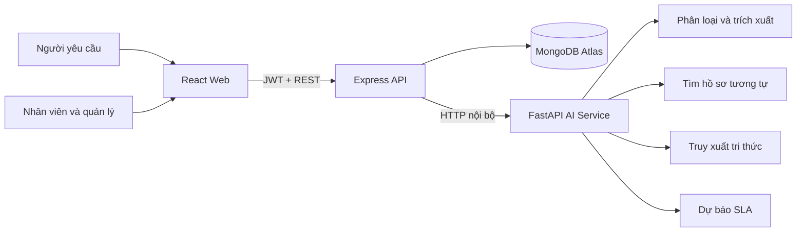
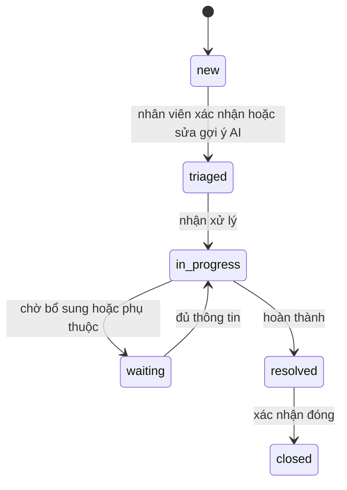

# Kiến trúc CaseFlow AI

## Bối cảnh

Ứng dụng quản lý truyền thống thường chỉ lưu biểu mẫu và trạng thái. CaseFlow AI tập trung vào toàn bộ vòng đời của một yêu cầu dịch vụ: tiếp nhận đa kênh, hiểu nội dung, điều phối, kiểm soát SLA, phối hợp nội bộ, phát hiện sự cố và tái sử dụng tri thức.

## Thành phần

### Web

- Giao diện responsive dùng chung, điều hướng thay đổi theo quyền.
- Route tải lười để trang đăng nhập không tải thư viện biểu đồ.
- Các màn hình: tổng quan, tạo yêu cầu, danh sách hồ sơ, chi tiết hồ sơ, sự cố, kho tri thức, dịch vụ và nhân sự.

### API

- Xác thực JWT và phân quyền theo vai trò.
- Phạm vi dữ liệu được giới hạn theo `organizationId`; người yêu cầu chỉ xem hồ sơ của mình.
- Validation bằng Zod, rate limit cho đăng nhập, Helmet, CORS và xử lý lỗi tập trung.
- Nếu dịch vụ AI tạm thời không hoạt động, API dùng cơ chế fallback để nghiệp vụ chính vẫn tiếp tục.

### AI service

- Phân loại yêu cầu tiếng Việt bằng TF-IDF và Logistic Regression.
- Trích xuất mã sinh viên, địa điểm và thời hạn bằng biểu thức có kiểm soát.
- Tìm hồ sơ tương tự và tài liệu bằng cosine similarity.
- Dự báo rủi ro SLA bằng Logistic Regression trên bộ dữ liệu mô phỏng có seed cố định.

### MongoDB

Các collection chính: `organizations`, `users`, `servicedefinitions`, `caserecords`, `attachments`, `notifications`, `incidents`, `knowledgearticles` và `auditlogs`.

## Vòng đời hồ sơ

Mỗi lần tạo, phân loại, giao người xử lý, đổi trạng thái hoặc phản hồi đều tạo một sự kiện trong timeline. Ghi chú nội bộ bị chặn đối với vai trò người yêu cầu.

## Phân quyền

| Vai trò | Khả năng chính |
|---|---|
| `requester` | Tạo, xem và phản hồi hồ sơ của mình; tìm kho tri thức |
| `agent` | Xem hàng đợi tổ chức, cập nhật hồ sơ, ghi chú nội bộ |
| `manager` | Toàn bộ quyền agent, xem sự cố và dashboard quản trị |
| `org_admin` | Quản lý danh mục dịch vụ và tài khoản trong tổ chức |
| `platform_admin` | Nền tảng cho quản trị đa tổ chức trong giai đoạn sau |

## Quyết định phạm vi

- Bản demo seed một tổ chức, nhưng đăng nhập và mọi truy vấn nghiệp vụ đã được giới hạn theo mã tổ chức và `organizationId`.
- Chưa có email gateway, SSO và background queue. Tệp đang lưu trên ổ đĩa cục bộ cho POC; kênh email/điện thoại hiện được nhân viên ghi nhận trên cùng form.
- AI chỉ đề xuất dịch vụ và đội xử lý. Hồ sơ ở trạng thái `new` cho đến khi nhân viên xác nhận hoặc sửa phân loại; quyết định cuối được lưu để audit và tạo dữ liệu huấn luyện lại.
- Incident hiện có dữ liệu mẫu và tín hiệu cụm; job phát hiện tự động theo cửa sổ thời gian là bước nghiên cứu tiếp theo.
- Timeline đang nằm trong hồ sơ để demo dễ hiểu. Khi tải lớn, nên tách thành collection append-only và thêm audit log bất biến.

## Hướng triển khai thực tế

1. SSO/OIDC, refresh token, MFA cho quản trị và tenant resolution theo subdomain.
2. Object storage cho tệp đính kèm, quét mã độc và chính sách lưu trữ.
3. Queue cho email, indexing, cảnh báo SLA và incident detection định kỳ.
4. OpenTelemetry, log tập trung, backup, monitoring và quy trình khôi phục.
5. Bộ kiểm thử end-to-end, kiểm thử tải, kiểm thử phân quyền và đánh giá model trước khi pilot.
