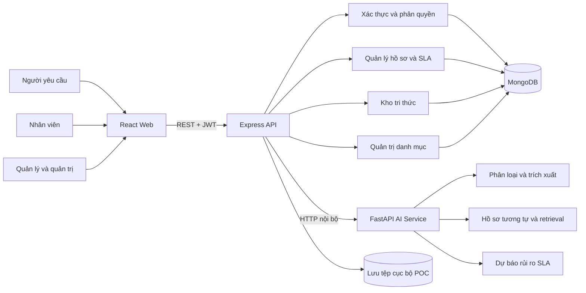
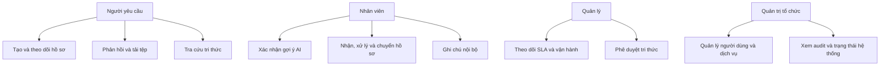
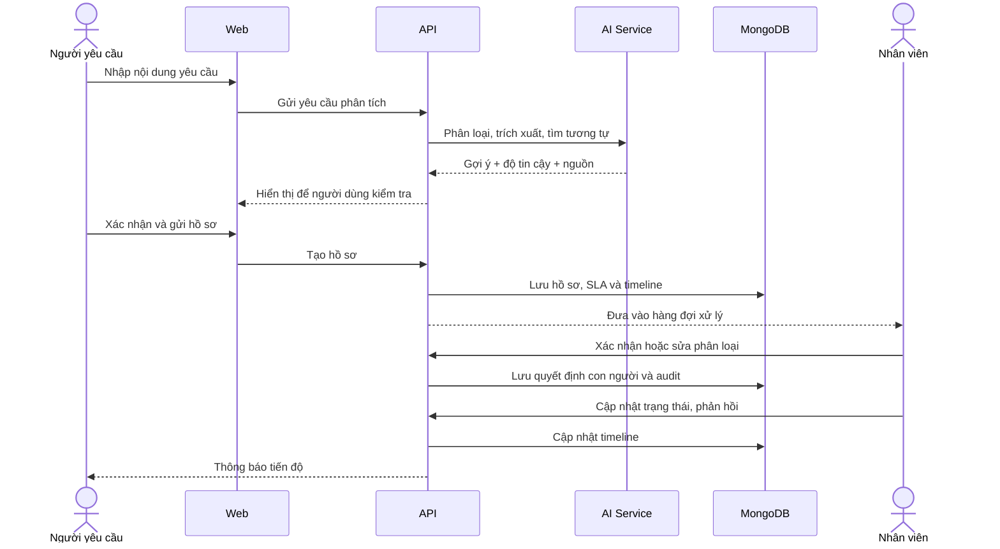
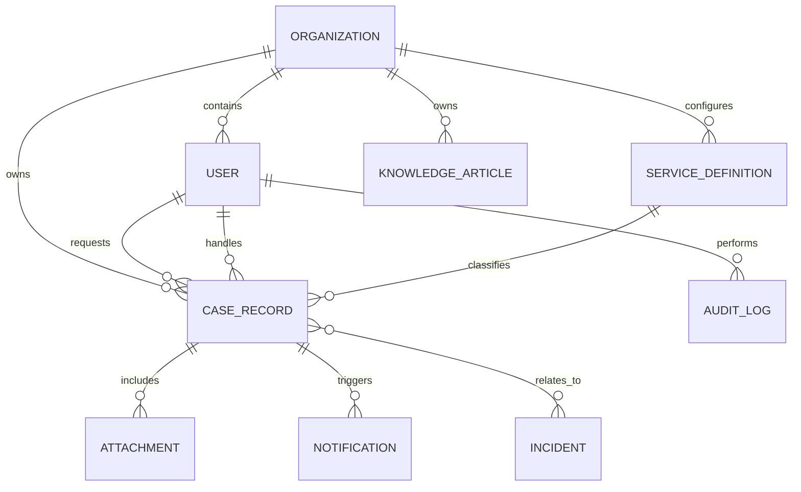

# Sơ đồ hệ thống

Các sơ đồ phản ánh phạm vi đã triển khai. Thành phần phát hiện cụm sự cố tự động và mô hình AI nâng cao là hướng phát triển, không được thể hiện như chức năng đã hoàn tất.

## Kiến trúc thành phần

## Use case theo vai trò

## Luồng xử lý chính

## Mô hình dữ liệu khái quát

## Ranh giới AI và nghiệp vụ

AI chỉ tạo gợi ý. API quyết định quyền truy cập, trạng thái hợp lệ, thời hạn SLA và việc ghi audit. Nhân viên chịu trách nhiệm xác nhận hoặc sửa kết quả trước khi điều phối. Thiết kế này cho phép đo mức đóng góp của AI mà không đặt tính đúng đắn của quy trình vào một mô hình xác suất.
