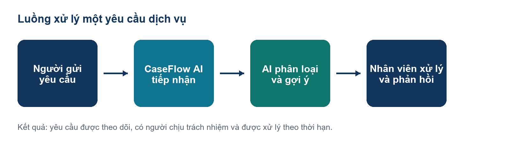
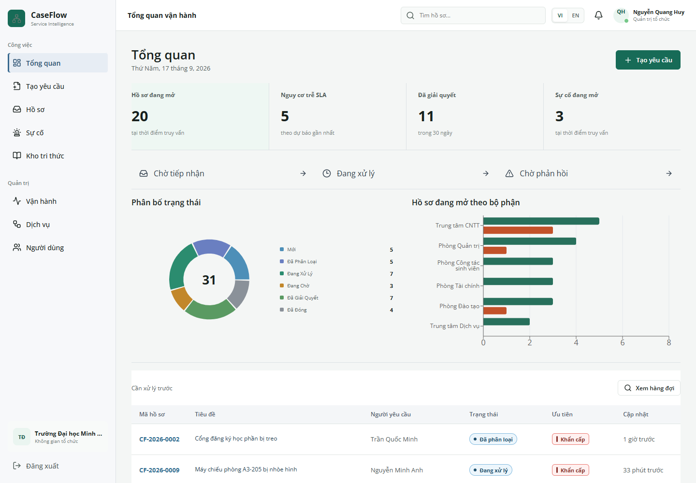
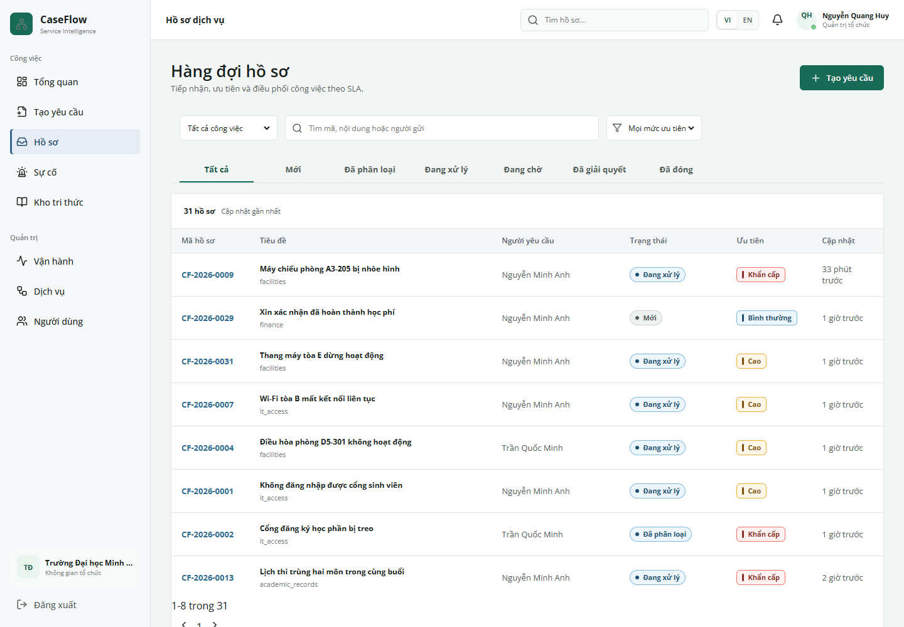
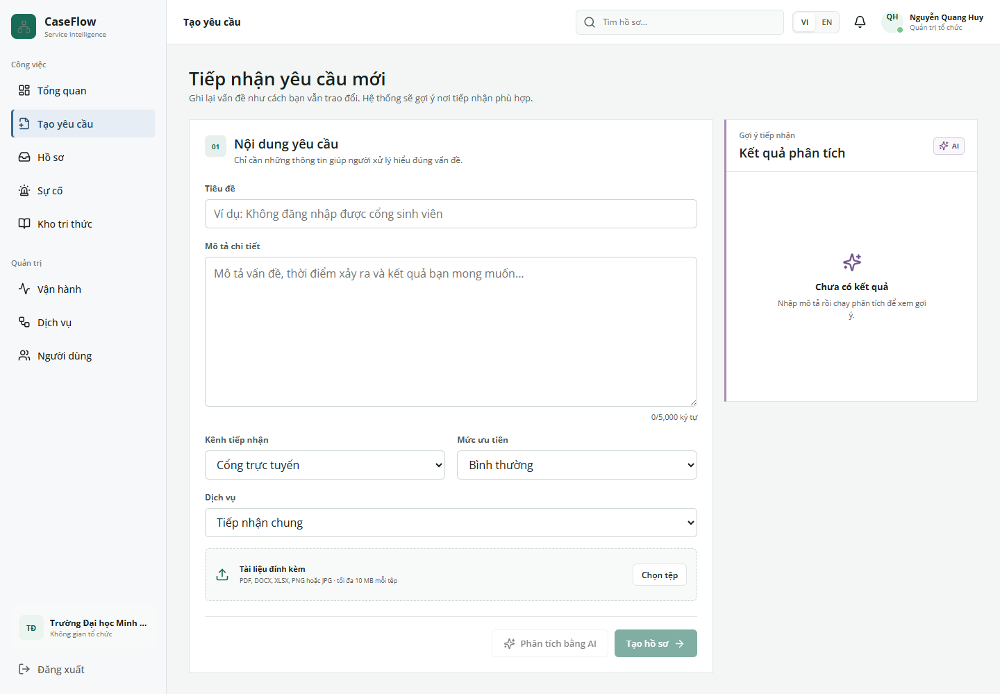
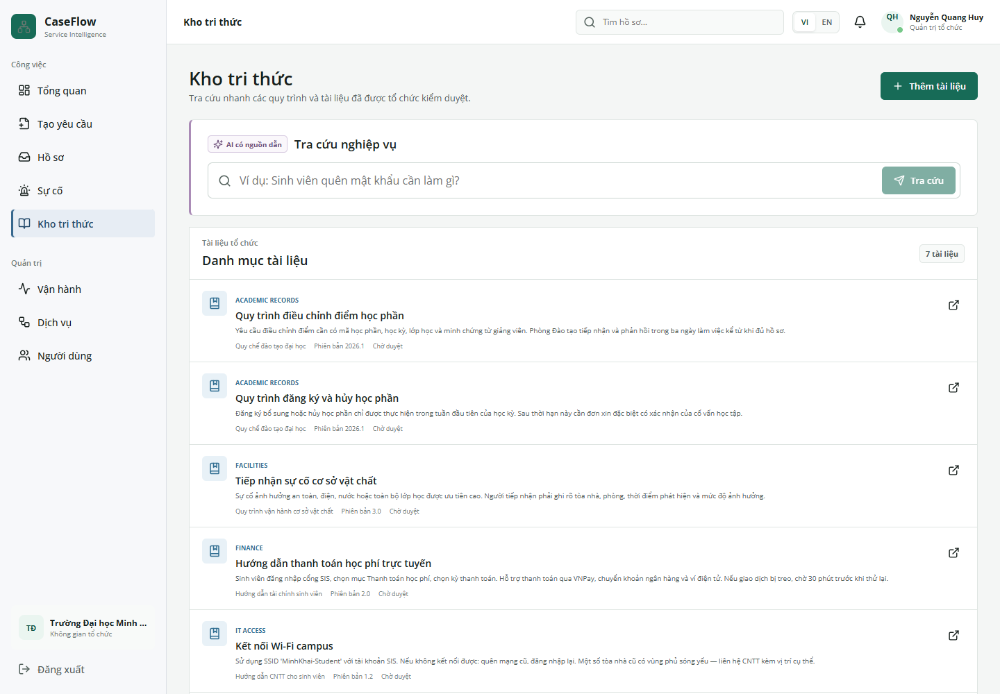
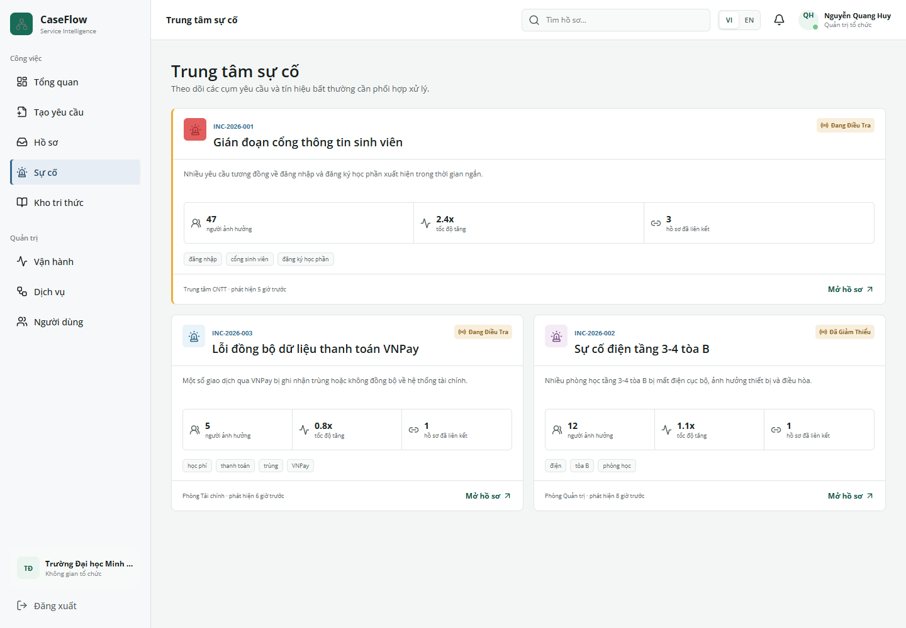
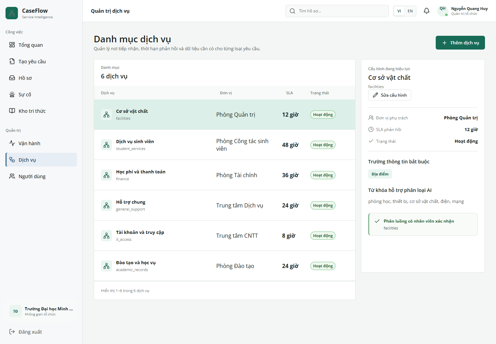
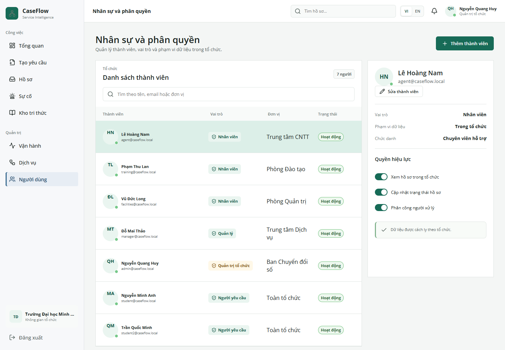
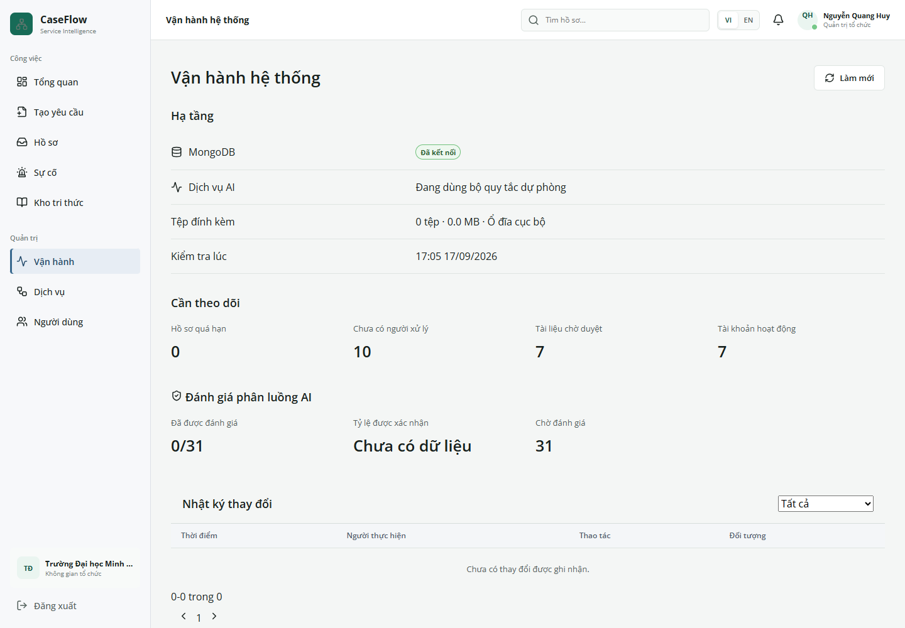
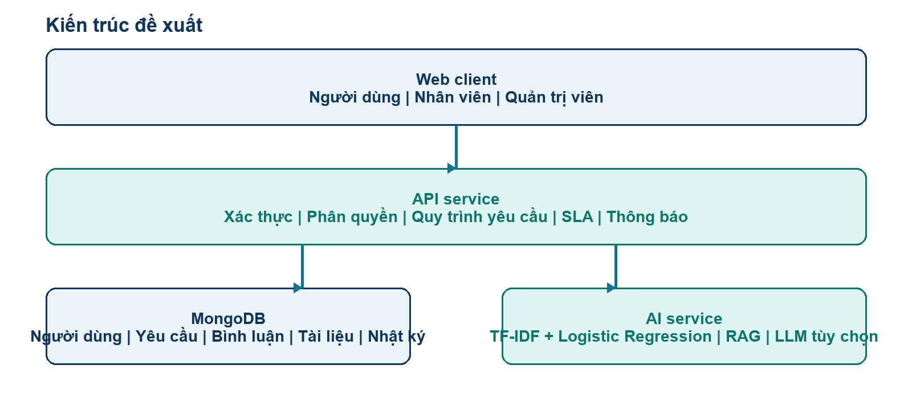

# Hệ thống quản lý yêu cầu dịch vụ tích hợp AI hỗ trợ phân loại và truy xuất tri thức

## 1 Bài toán và bối cảnh ứng dụng

CaseFlow AI quản lý vòng đời của một yêu cầu hỗ trợ, từ lúc người dùng gửi vấn đề đến lúc bộ phận phụ trách xử lý và phản hồi. Bối cảnh đang triển khai là dịch vụ sinh viên và IT helpdesk trong trường đại học. Ví dụ: sinh viên không đăng nhập được tài khoản, cần xác nhận giấy tờ hoặc phản ánh thiết bị phòng học gặp sự cố.

Khi các yêu cầu nằm ở nhiều email, nhóm chat và cuộc gọi, người gửi khó biết ai đang xử lý; nhân viên phải hỏi lại thông tin; quản lý khó biết hồ sơ nào bị bỏ sót hoặc sắp quá hạn. Hệ thống tập hợp thông tin thành một hồ sơ có mã định danh, người phụ trách, trạng thái, thời hạn và lịch sử trao đổi.

Việc gọi điện vẫn có giá trị khi cần hỗ trợ nhanh. Nhân viên có thể tiếp nhận thông tin từ kênh khác và ghi nhận vào hệ thống để theo dõi tiếp. Giá trị chính của sản phẩm là điều phối, kiểm soát và lưu lại quá trình xử lý, chứ không yêu cầu mọi tình huống phải bắt đầu bằng một biểu mẫu dài.

Đích triển khai ban đầu là một tổ chức với danh mục dịch vụ và quy trình rõ ràng. Kiến trúc có thông tin tổ chức và phân quyền, nhưng mở rộng sang doanh nghiệp hoặc lĩnh vực khác vẫn cần cấu hình danh mục, dữ liệu huấn luyện và kiểm chứng quy trình tại đơn vị mới.

## 2 Một tình huống sử dụng xuyên suốt

Sinh viên gửi yêu cầu: “Em không đăng nhập được tài khoản học tập, hệ thống báo tài khoản bị khóa. Em đã thử đặt lại mật khẩu nhưng vẫn không vào được, ngày mai cần nộp bài.” Người gửi nhập tiêu đề, mô tả và có thể đính kèm ảnh lỗi. Hệ thống có thể gợi ý tài liệu liên quan ngay trong bước nhập yêu cầu.

Khi chạy phân tích, mô-đun AI trả nhóm dịch vụ dự đoán, độ tin cậy, các nhãn ứng viên và thông tin trích xuất nếu nhận diện được. Nếu chưa đủ tin cậy, yêu cầu cần con người kiểm tra; kết quả AI không được hiểu là quyết định đúng tuyệt đối.

Nhân viên hoặc quản lý xem yêu cầu, kiểm tra loại dịch vụ và chọn người phụ trách. Nhân viên có thể yêu cầu thêm thông tin, ghi chú nội bộ, tra cứu hướng dẫn đã phê duyệt và cập nhật tiến độ. Người gửi theo dõi phản hồi trong cùng hồ sơ.

Quản lý theo dõi thời hạn SLA và khối lượng công việc. Khi vấn đề được giải quyết, hồ sơ lưu lại nội dung xử lý để làm nguồn tham khảo về sau. Nếu nhiều yêu cầu cùng phản ánh một sự cố, nhân viên có thể quản lý chúng theo cụm sự cố.

## 3 Các vai trò trong hệ thống

Người yêu cầu: sử dụng cổng gửi yêu cầu, xem danh sách và chi tiết hồ sơ trong phạm vi được cấp quyền, bổ sung thông tin và tra cứu kho tri thức được công bố. Trong bản demo, vai trò này là sinh viên.

Nhân viên xử lý: làm việc với hàng đợi và hồ sơ được phép truy cập, cập nhật trạng thái, trao đổi với người gửi, thêm ghi chú nội bộ và sử dụng gợi ý AI. Nhân viên cần kiểm tra nội dung nguồn trước khi dùng bản nháp trả lời.

Quản lý: theo dõi vận hành, xem hàng đợi cần ưu tiên, phân công và giám sát tiến độ. Giao diện quản lý còn có các màn hình cấu hình dịch vụ, thành viên và vận hành theo quyền được cấp.

Quản trị tổ chức: quản lý tài khoản, vai trò và cấu hình trong tổ chức. Phân quyền phải được kiểm soát tại API; việc ẩn nút trên giao diện chỉ là một phần trải nghiệm, không thay thế kiểm tra quyền ở máy chủ.

## 4 Tổng quan và giám sát công việc

Trang tổng quan giúp người dùng nắm tình hình yêu cầu theo phạm vi của mình. Đối với người phụ trách vận hành, dashboard là nơi xem số lượng hồ sơ, các nhóm trạng thái và công việc cần chú ý trước khi mở chi tiết.

Các chỉ số cần được đọc cùng định nghĩa và dữ liệu nguồn. Dữ liệu trong ảnh là dữ liệu demo được seed vào MongoDB tạm để minh họa luồng hoạt động; các con số không phải thống kê của một trường đang triển khai thực tế.

## 5 Danh sách yêu cầu và hàng đợi

Danh sách yêu cầu là màn hình làm việc chính. Người dùng tìm và mở hồ sơ, xem thông tin nhận diện, trạng thái và các thuộc tính phục vụ xử lý. Hàng đợi hỗ trợ tập trung vào nhóm việc như chưa được phân công hoặc sắp đến hạn.

Ví dụ đầu ngày, quản lý mở hàng đợi chưa phân công để giao việc; sau đó kiểm tra nhóm sắp đến hạn để xác định việc cần can thiệp. Mỗi hồ sơ có trang riêng, giúp trao đổi và cập nhật tập trung thay vì tìm lại nhiều tin nhắn.

## 6 Tiếp nhận yêu cầu và hỗ trợ tại thời điểm nhập

Biểu mẫu tạo yêu cầu gồm tiêu đề, mô tả, loại dịch vụ, mức ưu tiên, kênh tiếp nhận, các trường riêng của dịch vụ và tệp đính kèm. Danh mục dịch vụ có thể điều khiển trường thông tin cần thu thập để phù hợp từng nghiệp vụ.

Khi mô tả đủ nội dung, giao diện tra cứu các tài liệu liên quan và hiển thị gợi ý. Người gửi có thể tham khảo cách xử lý trước khi gửi. Nút phân tích AI dùng tiêu đề và mô tả để đề xuất loại dịch vụ; loại dịch vụ chỉ được tự điền theo điều kiện độ tin cậy của luồng hiện tại.

Mức ưu tiên là trường nghiệp vụ có thể lựa chọn. Tài liệu không coi đây là một mô hình phân loại ưu tiên đã được huấn luyện và kiểm chứng độc lập. Tệp đính kèm được tải qua API; hiện tại tệp nằm trên ổ đĩa máy chủ, MongoDB giữ thông tin mô tả tệp.

## 7 Hồ sơ chi tiết và phối hợp xử lý

Trang chi tiết tập hợp nội dung yêu cầu, tình trạng xử lý, người phụ trách, thông tin liên quan và các thao tác nghiệp vụ. Nhân viên có thể cập nhật trạng thái, phân công hoặc chuyển xử lý theo quyền, bổ sung ghi chú và trao đổi với người gửi.

Ghi chú nội bộ dùng cho phối hợp giữa nhân viên. Phản hồi công khai dùng để trao đổi với người yêu cầu. Việc tách hai phạm vi này tránh đưa thông tin điều phối nội bộ vào nội dung trả lời cho người gửi.

Gợi ý phân công hỗ trợ xem xét nhân sự và tải công việc, nhưng người phụ trách vẫn chọn người nhận. Lịch sử xử lý và audit giúp truy lại thao tác nào đã xảy ra, do ai thực hiện và vào thời điểm nào. Không nên nhầm audit log ứng dụng với một cơ chế lưu trữ bất biến đã được chứng nhận.

## 8 Kho tri thức và bản nháp có nguồn

Kho tri thức lưu các hướng dẫn và quy trình phục vụ xử lý yêu cầu. Tài liệu có bước phê duyệt trước khi được công bố cho người dùng hoặc sử dụng trong truy xuất. Điều này giúp tránh dùng một hướng dẫn chưa được xác nhận làm căn cứ trả lời.

Người dùng đặt câu hỏi, hệ thống truy xuất nguồn phù hợp và trả lại đoạn liên quan cùng trích dẫn. Baseline sử dụng TF-IDF và cosine similarity, tức là mức tương đồng dựa trên đặc trưng từ vựng. Đây chưa phải hệ truy xuất embedding ngữ nghĩa hoàn chỉnh.

Luồng soạn bản nháp có thể gọi dịch vụ LLM bên ngoài khi được cấu hình và người dùng chọn chức năng tương ứng. LLM dùng nguồn đã truy xuất để diễn đạt câu trả lời; nội dung được thể hiện là bản nháp cần kiểm duyệt. Khi nhà cung cấp không sẵn sàng, hệ thống có nhánh trả kết quả truy xuất nội bộ.

RAG là cách kết hợp truy xuất tài liệu với sinh câu trả lời. Cập nhật kho tri thức không đồng nghĩa huấn luyện lại trọng số của ChatGPT. Phần phân loại nội bộ và phần sinh văn bản qua API là hai thành phần có cách vận hành và đánh giá khác nhau.

## 9 Cụm sự cố và theo dõi vấn đề lặp lại

Một sự cố diện rộng có thể tạo nhiều yêu cầu riêng lẻ, chẳng hạn nhiều sinh viên cùng không truy cập được một dịch vụ. Màn hình sự cố giúp nhân viên xem và quản lý vấn đề theo cụm, tạo góc nhìn vượt ra ngoài từng hồ sơ đơn lẻ.

Phát hiện nội dung tương tự chỉ là tín hiệu hỗ trợ. Hai yêu cầu giống từ vựng chưa chắc có cùng nguyên nhân; việc xác nhận cụm cần người xử lý kiểm tra. Giá trị mong muốn là giảm việc điều tra và trả lời lặp lại cho cùng một sự cố.

## 10 Cấu hình dịch vụ và quản lý thành viên

Danh mục dịch vụ xác định nhóm yêu cầu mà tổ chức tiếp nhận, đơn vị phụ trách và cấu hình xử lý. Giao diện hỗ trợ tạo, sửa và tạm dừng dịch vụ. Cấu hình theo dịch vụ giúp hệ thống thích ứng với nghiệp vụ mà không phải sửa lại toàn bộ mã nguồn.

Quản lý thành viên hỗ trợ thêm, sửa và vô hiệu hóa tài khoản theo quyền. Vai trò và đơn vị của thành viên liên quan trực tiếp đến phạm vi thao tác trong quy trình yêu cầu. Việc khóa tài khoản cần được thực thi ở backend, không chỉ thay đổi trạng thái hiển thị.

## 11 Vận hành và các chức năng hỗ trợ

Trang vận hành cung cấp góc nhìn về kết nối MongoDB, dịch vụ AI, lưu tệp, hồ sơ quá hạn và nhật ký. Ảnh được chụp trong môi trường demo cô lập có chủ ý không kết nối AI ngoài; trạng thái dịch vụ trong ảnh phản ánh môi trường chụp, không chứng minh mọi dịch vụ production đang hoạt động.

Hệ thống có đăng nhập, trang hồ sơ cá nhân, đổi ngôn ngữ Việt/Anh, thông báo và luồng yêu cầu đặt lại mật khẩu. Gửi email thực tế cần cấu hình SMTP. API key và URI cơ sở dữ liệu được cấu hình phía máy chủ qua biến môi trường, không đưa vào tài liệu gửi giảng viên.

## 12 Kiến trúc và dòng dữ liệu

Frontend dùng React, TypeScript và Vite để cung cấp giao diện theo vai trò. API nghiệp vụ dùng Express và TypeScript, chịu trách nhiệm xác thực, phân quyền, kiểm tra dữ liệu, xử lý hồ sơ và đọc ghi MongoDB thông qua Mongoose. Dịch vụ AI viết bằng Python và FastAPI, sử dụng scikit-learn cho các baseline hiện tại.

Ví dụ khi tạo yêu cầu: trình duyệt gửi dữ liệu đến API; API xác minh người dùng và tổ chức, kiểm tra dữ liệu rồi lưu hồ sơ. Khi phân tích AI, API gọi dịch vụ AI và chuyển kết quả phù hợp về giao diện. Khi soạn bản nháp, hệ thống truy xuất tài liệu trong phạm vi được phép trước khi gọi LLM đã cấu hình.

Tách dịch vụ AI cho phép thay model hoặc cách truy xuất mà ít ảnh hưởng hệ thống nghiệp vụ. Đổi lại cần quản lý timeout, lỗi kết nối và cơ chế trả kết quả thay thế. Circuit breaker giúp tạm ngừng gọi một dịch vụ đang lỗi, giảm việc lặp lại các yêu cầu khó thành công.

## 13 Dữ liệu nghiệp vụ và dữ liệu AI

Các nhóm dữ liệu chính gồm tổ chức, người dùng, định nghĩa dịch vụ, yêu cầu, trao đổi, thông tin tệp, tài liệu tri thức, sự cố và nhật ký. Yêu cầu liên hệ với người gửi, dịch vụ và người xử lý; bình luận và tệp gắn với hồ sơ; các thao tác quan trọng tạo thông tin lịch sử.

MongoDB lưu dữ liệu nghiệp vụ lâu dài. Tệp tải lên hiện lưu trên ổ đĩa, cần phương án object storage và backup nếu triển khai nhiều máy hoặc môi trường thật. MongoDB không tự làm cho dữ liệu trở thành tập huấn luyện: muốn học từ hồ sơ phải có bước chọn mẫu, ẩn danh, gán nhãn và kiểm duyệt.

Dữ liệu phân loại cần nội dung yêu cầu và nhãn dịch vụ đúng. Dữ liệu truy xuất cần tài liệu được phê duyệt, nguồn, thời điểm hiệu lực và quyền truy cập. Dữ liệu SLA cần mốc thời gian, thời hạn, số lần chuyển, tải công việc và kết quả có trễ hay không.

## 14 Các kỹ thuật AI hiện có và giới hạn

Phân loại yêu cầu: TF-IDF biến văn bản thành vector đặc trưng; Logistic Regression học quan hệ giữa đặc trưng và nhãn dịch vụ. Đầu ra gồm nhãn dự đoán, điểm tin cậy và các ứng viên. Điểm tin cậy chưa mặc nhiên là xác suất đúng đã được hiệu chỉnh trên dữ liệu thực tế.

Trích xuất thông tin: sử dụng các pattern tiếng Việt có kiểm soát để nhận diện một số trường như mã sinh viên hoặc phòng. Đây là phương pháp dựa trên quy tắc, không nên mô tả như một mô hình NER đã được fine-tune.

Tìm yêu cầu và tài liệu tương tự: TF-IDF kết hợp cosine similarity xếp hạng nội dung theo đặc trưng từ vựng. Phương pháp nhẹ và dễ giải thích nhưng hạn chế với diễn đạt khác từ, viết tắt, câu ngắn hoặc từ vựng ngoài dữ liệu.

Rủi ro SLA: baseline Logistic Regression khai thác đặc trưng vận hành để đưa ra mức rủi ro. Mô hình hiện dùng dữ liệu mô phỏng để minh họa luồng cảnh báo; chưa đủ cơ sở kết luận hiệu quả dự báo tại một tổ chức thật.

LLM: được tích hợp qua API tương thích Chat Completions để hỗ trợ diễn đạt bản nháp có nguồn. Tính đúng của kết quả cần được kiểm tra cả ở bước truy xuất lẫn bước sinh câu trả lời. Gọi API không có nghĩa nhóm đã tự huấn luyện mô hình nền tảng.

## 15 Phần nghiên cứu và phương án đánh giá

Bài toán nghiên cứu chính nên tập trung vào phân loại yêu cầu tiếng Việt và truy xuất tri thức hỗ trợ xử lý. SLA có thể giữ như chức năng bổ trợ nếu chưa thu thập đủ dữ liệu thời gian thực. Cách giới hạn này giúp dành công sức cho thực nghiệm có thể kiểm chứng.

Phân loại: so sánh word TF-IDF và character TF-IDF trên cùng tập dữ liệu và cách chia tập, sau đó cân nhắc PhoBERT khi đủ dữ liệu và tài nguyên. Báo cáo accuracy, precision, recall, macro/micro F1, confusion matrix và ví dụ sai. Macro F1 giúp nhìn rõ ảnh hưởng của các nhóm ít dữ liệu.

Truy xuất: xây bộ câu hỏi và nguồn đúng do người gán nhãn xác nhận, đánh giá Recall@K và thứ hạng tài liệu. Với sinh câu trả lời, đánh giá riêng tính đúng, độ đầy đủ, nguồn hỗ trợ và khả năng từ chối khi thiếu căn cứ. Câu trả lời trôi chảy chưa đủ để kết luận đúng.

Chia dữ liệu cần giữ các câu gần trùng hoặc cùng sự cố trong một tập, tránh train và test chứa hai bản của cùng yêu cầu. Tập validation dùng chọn tham số và ngưỡng; tập test chỉ dùng đánh giá cuối. Mẫu demo nhỏ hiện tại dùng kiểm tra pipeline, không dùng làm kết quả luận văn chính.

Quy mô dữ liệu cần chốt sau khảo sát: ưu tiên một số nhóm dịch vụ rõ ràng, có đủ mẫu cho từng nhãn. Có thể đặt mục tiêu vài trăm mẫu mỗi nhãn nhưng đây là kế hoạch thu thập, chưa phải số dữ liệu thật đã có. Nguồn mở phải được kiểm tra giấy phép, ngôn ngữ và mức phù hợp nghiệp vụ.

## 16 Kịch bản trình diễn và kiểm thử

Bước 1: đăng nhập sinh viên, tạo yêu cầu có nội dung cụ thể, xem tài liệu được gợi ý và chạy phân tích nếu dịch vụ AI đang bật. Quan sát nhãn và thông báo cần kiểm tra, không chỉ quan sát việc nút bấm trả kết quả.

Bước 2: đăng nhập nhân viên hoặc quản lý, mở yêu cầu vừa tạo, kiểm tra phân loại, giao người xử lý, thêm phản hồi và ghi chú nội bộ. Đăng nhập lại người gửi để kiểm tra phạm vi thông tin được nhìn thấy.

Bước 3: tra cứu kho tri thức, mở nguồn trích dẫn và đối chiếu nội dung. Khi cấu hình LLM hoạt động, chạy thêm nhánh soạn bản nháp; khi không có LLM, vẫn trình diễn được truy xuất nguồn nội bộ.

Bước 4: mở danh sách hàng đợi, dashboard và trang vận hành để xem trạng thái hồ sơ. Thử tài khoản khác vai trò để kiểm tra quyền quản lý dịch vụ, thành viên và sự cố.

Kiểm thử cần bao gồm đường đi thành công và tình huống lỗi: dữ liệu nhập thiếu, thao tác sai quyền, tài liệu chưa duyệt, tệp không hợp lệ, AI không phản hồi và token đặt lại mật khẩu hết hạn. Các số lượng test ghi trong báo cáo cũ là kết quả của đợt kiểm thử trước, cần chạy lại khi dùng làm bằng chứng cho phiên bản nộp.

## 17 Trạng thái triển khai và công việc còn lại

Đã có trong mã nguồn: các màn hình trình bày phía trên, API quản lý nghiệp vụ, kết nối MongoDB, baseline AI, truy xuất tri thức, cổng LLM tùy chọn và các kiểm thử tự động. Ảnh trong tài liệu được chụp từ ứng dụng đang chạy với dữ liệu demo; không phải bản vẽ giao diện.

Cần hoàn thiện cho luận văn: khảo sát đơn vị dùng thử, chốt quy trình và nhãn, thu thập bộ dữ liệu được phép sử dụng, xây tập test có nhãn chuẩn, so sánh mô hình và thực hiện kiểm thử với người dùng. Chưa có bằng chứng từ triển khai thật để khẳng định đã giảm thời gian xử lý hoặc tăng tỷ lệ đúng SLA.

Cần hoàn thiện nếu triển khai thật: chiến lược sao lưu/khôi phục, lưu tệp tập trung, quan sát lỗi, kiểm thử tải, quản lý secrets, vận hành email và kiểm soát quyền truy cập dữ liệu. Mức độ ưu tiên phụ thuộc quy mô đơn vị thử nghiệm.

Hướng mở rộng: embedding và reranking cho truy xuất, dùng phản hồi sửa nhãn để xây tập huấn luyện có kiểm duyệt, theo dõi chất lượng model theo phiên bản và hỗ trợ thêm lĩnh vực sau khi kiểm chứng thành công phạm vi trường đại học.
